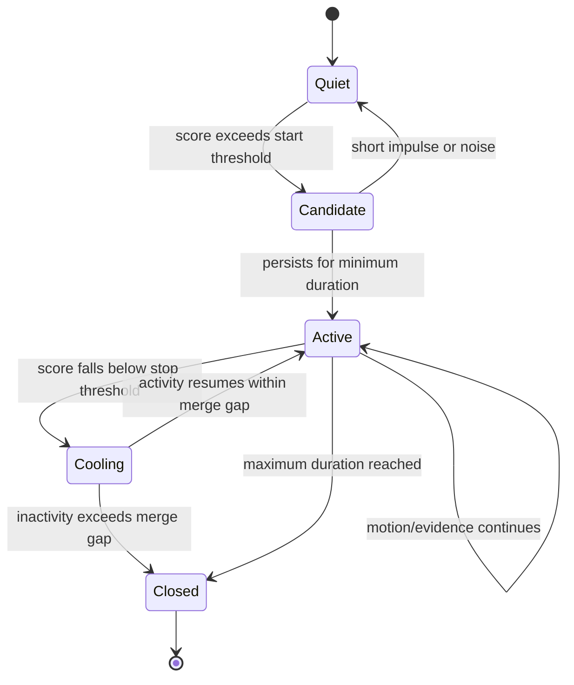
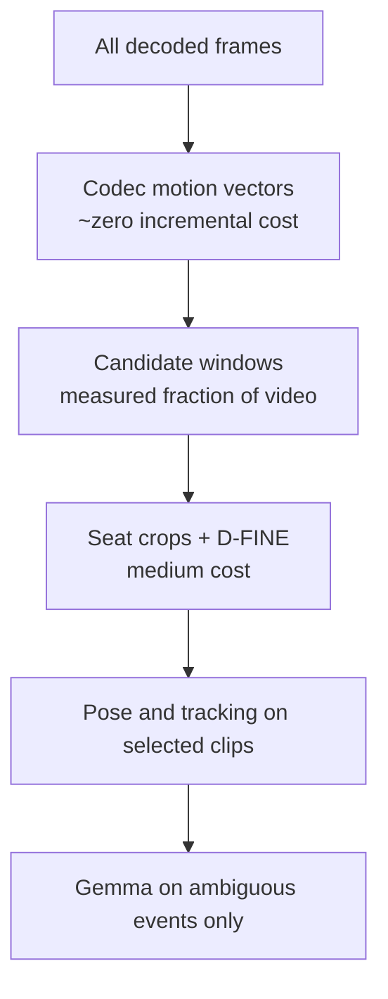

# Project Classroom
## Decision-Grade Product Requirements Document

**Problem Statement:** Drishti AI Hackathon 2026 — Problem Statement 2
**Working title:** Project Classroom
**Document status:** Build specification
**Version:** 3.0
**Date:** 18 August 2026
**Team:** DataDynamo

> **One-line pitch:** Project Classroom converts hours of recorded examination-hall footage into a short, searchable timeline of motion-grounded, seat-linked events with visual evidence and confidence—without making automated accusations.

---

## Changelog: v2.1 → v3.0

This revision is driven by measurements taken from the actual source footage and by a platform decision. Nothing here is aspirational; every number in §5 was measured.

| Change | Reason |
|---|---|
| DeepStream and `gst-nvof` removed from the architecture | Linux/WSL2-only, and the whole-video motion pass measures 12 minutes for 5 hours of footage on CPU. The dependency buys nothing this pipeline needs. |
| Codec motion vectors are now the primary motion layer | Verified present in all six source files including MPEG-4; ~3,600 vectors/frame at 16×16 blocks, extracted at decode speed. |
| Deployment scene model added (§4) | The footage is a computer-based test centre, not a paper exam hall. Live monitors, typing baselines and burned-in overlays are dominant motion sources the v2.1 model did not anticipate. |
| Measured footage appendix added (§5) | 720p not 1080p; VFR confirmed on half the files; phone footprint measured at ~30×20 px. |
| All fallback ladders removed | Single canonical path per layer. One detector, one pose model, one tracker, one verifier profile. |
| Three of four mandatory A/B benchmarks cut | NvDCF, Deep OC-SORT, Multi-HMR2 and SAT-HMR removed. Seat anchoring makes the tracking comparison moot. |
| Hardware profile collapsed to a single target | 32 GB RTX-class GPU. No constrained-GPU scheduling, no sequential-residency logic, no VRAM safety-margin machinery. |
| Full-frame slicing replaced by seat-crop supersampling | At 1280×720 into a 640 input, slicing gains little; native-resolution crops upscaled into the detector are where small-object recall comes from. |
| Scoring weights hand-set, not learned | Insufficient event count to fit weights without overfitting. |

---

## 0. Executive Decision

Project Classroom is an **offline, post-examination video investigation system**. It does not attempt to continuously "detect cheating" from individual frames. It first finds meaningful motion, localizes it to calibrated seat and desk regions, gathers multiple independent evidence streams, and then prioritizes event clips for a human reviewer.

The stack is deliberately precision-first and has exactly one path through each layer:

- **PyAV/FFmpeg** for streaming decode and presentation-timestamp-accurate seeking.
- **Codec motion vectors** as the whole-video motion layer; **DIS optical flow** for sub-pixel refinement on candidate windows only.
- **Seat/desk-anchored regions** with explicit screen, desk and torso zones as the stable identity and localization layer.
- **D-FINE-L**, fine-tuned from Objects365 weights, on native-resolution seat crops.
- **RTMO** via `rtmlib` for crowded-person pose.
- **ByteTrack** with mandatory seat reconciliation.
- **Gemma 4 E4B instruction-tuned** as the visual verifier with grammar-constrained JSON output.
- **FastAPI + React + SQLite + Roboflow Supervision** for the investigator experience, event storage, evaluation, and visual overlays.

No foundation model is trained from scratch. Exactly one component is fine-tuned: the object detector. Everything else runs at inference with calibration and threshold design.

---

## 1. Problem Statement

Examination authorities must manually inspect several hours of recorded surveillance footage to investigate incidents. Linear review is slow, tiring, inconsistent, and susceptible to missed events. Existing generic surveillance pipelines over-trigger on lighting changes and harmless motion, fail to separate overlapping activity in crowded halls, and provide little support for evidence-based review.

The problem statement requires an offline system that detects temporal motion; identifies meaningful Regions of Interest; segments long recordings into activity-based events; produces ROI overlays, motion heatmaps, timelines, and searchable logs; optionally identifies phones, paper/chits, or other prohibited objects; scales to long videos and multiple cameras; mitigates false motion, missed ROIs, segmentation errors, environmental variation, hardware limits, and data-security risks; and retains human oversight.

### 1.1 Core product problem

The product is not "Who is cheating?" The product problem is:

> **Which short portions of this recording deserve human attention, where did the relevant activity occur, and what evidence caused the system to prioritize them?**

A suspicious action is contextual and temporal. Looking sideways, moving a hand below a desk, or holding paper can each be normal. Project Classroom reports **observations and evidence**, not guilt or intent.

---

## 2. Proposed Solution

Project Classroom performs a calibrated first pass over recorded footage using codec-derived motion vectors and seat-aware motion statistics. It converts continuous motion into candidate events. Only those candidates enter the more expensive detector, pose, tracking, temporal reasoning, and visual-verification stages.

Each final event contains source video and camera identifier; exact start and end timestamp; seat/desk ROI and motion mask; an evidence clip with pre-roll and post-roll; detected object evidence, if any; pose and interaction evidence, if reliable; confidence and uncertainty indicators; an explanation using observational language; a complete audit trail to the source frames; and human-review status and notes.

### 2.1 What the solution explicitly does not do

- It does not use facial recognition.
- It does not identify a student by name.
- It does not treat a VLM statement as ground truth.
- It does not declare that cheating occurred.
- It does not promise reliable finger-level gestures when the source pixels are insufficient.
- It does not require real-time processing.
- It does not assume all cameras have audio or synchronized timestamps.
- It does not train a foundation model from scratch.

---

## 3. Why the Idea Is Different

### 3.1 Evidence fusion instead of a single "cheating detector"

Generic systems map one model confidence directly to an alert. Project Classroom requires agreement across evidence types:

1. **Motion evidence:** Did meaningful non-global motion occur, relative to this seat's own activity baseline?
2. **Spatial evidence:** Which seat/desk region produced it, and in which zone?
3. **Object evidence:** Is a phone-like or paper-like object visible?
4. **Pose evidence:** Are head, wrist, torso, or person-to-person relationships temporally unusual?
5. **Temporal evidence:** Was the pattern sustained or repeated?
6. **Visual verification:** Does a VLM support the observational description, or is it uncertain?

No evidence stream is sufficient alone.

### 3.2 Seat anchoring instead of biometric identity

In a seated examination, the desk location is more stable than a generic tracking ID. Tracks are continuously reconciled with calibrated seat polygons. This reduces identity switches, prevents one candidate's motion from being assigned to a neighbour, allows track recovery after short occlusion, improves explainability, and avoids face embeddings.

In this deployment the advantage is unusually strong: **seats carry physical numbered placards visible in frame**, so seat attribution is auditable by eye against the source video.

### 3.3 Tiered motion estimation instead of MOG2 or blanket dense flow

MOG2 is vulnerable to illumination changes, shadows, slowly adapting foregrounds, and compression noise; on the CDnet 2014 change-detection benchmark it is consistently outperformed by SuBSENSE, PAWCS and FgSegNet-v2. Blanket CLAHE amplifies noise and alters contrast differently across frames. Neither is used.

Running dense optical flow over every frame is the opposite error: it spends the pipeline's largest per-frame cost on the stage that needs the least precision. The motion pass only has to **gate**; precision is needed downstream.

Project Classroom therefore uses three tiers:

| Tier | Coverage | Method | Granularity |
|---|---|---|---|
| 1 — Gate | 100% of frames | Codec motion vectors from the bitstream | 16×16 blocks |
| 2 — Refine | Candidate windows | `cv2.DISOpticalFlow` | Per-pixel |
| 3 — Adjudicate | Disputed events only | Dense flow on extracted crops | Per-pixel, high quality |

Tier 1 is effectively free — the encoder already computed the field. On top of this: global camera-motion estimation, exposure-change detection, temporal median/MAD normalization per seat, persistent environmental-motion suppression, calibration-learned adaptive thresholds, and temporal hysteresis to prevent fragmented events.

### 3.4 Selective high-resolution inference

A phone occupies roughly 30×20 pixels at a near seat in this footage. Running a detector at 640×640 over the full 1280×720 frame destroys the detail needed to distinguish it from a wallet or a dark notebook.

Slicing the full frame — the standard SAHI approach — gains little here, because the frame is only a 2× downscale from the network input to begin with. Published SAHI gains of +6.8 to +14.5 AP come from aerial imagery where the frame vastly exceeds the input.

Project Classroom instead:

- detects motion at full-frame scale;
- maps it to seats;
- extracts seat/hand/desk crops **at native resolution**;
- **upscales the crop into the detector input**, giving genuine supersampling (a 200×200 crop into a 640 input is 3.2×);
- accumulates evidence across adjacent frames;
- abstains when the source resolution is fundamentally insufficient.

### 3.5 Human-review optimization as the actual success criterion

The product is successful only if it reduces review time while preserving event recall. A visually impressive detector with many false alarms fails the problem.

---

## 4. Deployment Scene Model

**This is a computer-based test (CBT) centre, not a paper examination hall.** Every seat has a live monitor, keyboard and mouse. This changes the motion model fundamentally and is the single most important correction in v3.0.

### 4.1 Consequences

| Property | Consequence for the pipeline |
|---|---|
| Live monitors displaying exam content | Every screen is a continuous, **aperiodic** motion source. The periodicity score used for fans and curtains will not suppress it. Requires an explicit per-seat screen mask. |
| Typing and mouse use | Every occupied seat has a high, constant hand-motion baseline. "Deviation from still" is the wrong null hypothesis; the baseline must model the *typing regime*. |
| Burned-in timestamp overlay | Updates once per second in a fixed region in every file. A guaranteed periodic motion blob. Requires a global overlay mask. |
| Burned-in camera label | Static; harmless; masked with the same mechanism. |
| Plastic-wrapped chairs | Specular highlights that shift with viewing angle and ambient light. |
| Glass partitions, wall mirror, interior window | Reflect people and monitors from adjacent rooms. Reflected persons may be detected as persons. Requires a reflection mask. |
| Standing invigilators and reception traffic | Cross frame frequently; must be suppressible via staff zones and manual marking. |
| Booth dividers | Heavy, structured occlusion of torso and arms. |

### 4.2 Zone model

The v2.1 desk-versus-upper-body split is insufficient. Each seat is calibrated into three zones:

| Zone | Contents | Role in scoring |
|---|---|---|
| `screen` | The monitor face | **Excluded from motion scoring entirely** |
| `desk` | Keyboard, mouse, desk surface, lap-adjacent region | Typing baseline established here; below-desk excursions are the signal of interest |
| `torso` | Upper body, shoulders, head | Head pitch/yaw and body rotation evidence |

### 4.3 Dominant behavioural pattern

The pattern visible in the source footage is **sustained downward head pitch with hand dwell in the lap region** — a phone held below the desk line. This is measurable from pose and motion at 720p. The object frequently is not. The system is designed to score the behaviour and treat the object as corroboration.

---

## 5. Measured Source Footage

All figures measured 18 August 2026 with PyAV 18.1.0 against the source files. These supersede every hardware and resolution assumption in v2.1.

### 5.1 File inventory

| File | Container | Codec | Resolution | FPS | Duration | Mbps | VFR | MV/frame |
|---|---|---|---:|---:|---:|---:|---|---:|
| 01 · mobile phone | matroska | h264 | 1280×720 | 25.0 | 131 s | 1.95 | no | 3649 |
| 02 · mobile phone | matroska | h264 | 1280×720 | 25.0 | 212 s | 1.95 | no | 3621 |
| 03 · mobile usage | matroska | mpeg4 | 1280×720 | 12.1 | 282 s | 1.87 | **yes** | 3594 |
| 04 · candidate talking | matroska | h264 | 640×480 | 8.0 | 143 s | 0.24 | no | 1290 |
| 05 · reception crowd | mp4 | mpeg4 | 1280×720 | 25.0 | 241 s | 10.53 | **yes** | 3584 |
| Seat 12 · paper | matroska | mpeg4 | 1280×720 | 25.0 | 88 s | 1.75 | **yes** | 3575 |

### 5.2 Derived facts

- **Maximum resolution is 720p.** No 1080p source exists. One file is 640×480 at 8 fps, which is below the sampling rate needed to characterize hand gestures and is excluded from gesture evaluation.
- **Compression is ~0.08 bits/pixel** at 1.9 Mbps for 720p25. Block artifacts are guaranteed and will register as motion.
- **Variable frame rate is confirmed on three of six files.** Presentation timestamps are mandatory; frame-index arithmetic is prohibited.
- **Codec motion vectors are present in all six files**, MPEG-4 included, at 16×16 block granularity. I and P frames only; no B-frames.
- **Phone footprint measured at approximately 30×20 px** on a near-camera seat, motion-blurred, with no screen glow and no resolvable rectangle geometry. Far seats are smaller.
- **Four distinct camera views across four dates** (30-05-2025, 12-04-2025, 02-06-2026, 15-07-2026), enabling a genuine leave-one-room-out validation split.

### 5.3 Measured pass-1 throughput

Codec-MV extraction with per-block magnitude aggregation, single process, CPU only, on a 12-thread i5-12450H:

| Codec | Scan rate |
|---|---:|
| H.264 (worst case) | 627 fps |
| MPEG-4 Part 2 | 2,640–3,110 fps |
| Mean across files | 2,279 fps |

**5 hours at 25 fps = 450,000 frames → ~12 minutes worst case single-process.** This measurement is the basis for removing DeepStream: there is no decode bottleneck to accelerate.

### 5.4 Corpus status

Approximately 5 hours of recording is available. The 18.3 minutes profiled above are pre-cut incident clips. Continuous recording is required for event-recall and false-events-per-hour measurement, because clipped footage contains no negative time.

---

## 6. End-to-End Architecture

```mermaid
flowchart LR
    A["Recorded CCTV files"] --> B["PyAV ingest validation<br/>codec, PTS, VFR, checksum"]
    B --> C["Streaming decode"]
    C --> D["Codec motion vectors<br/>16x16 blocks, whole video"]
    D --> E["Global motion and exposure compensation"]
    E --> F["Mask application<br/>screen, overlay, reflection, environment"]
    F --> G["Seat-zone motion statistics<br/>vs typing baseline"]
    G --> H{"Candidate event?"}

    H -- "No" --> I["Store compact motion metadata"]
    H -- "Yes" --> J["Clip extraction by PTS seek"]

    J --> K["DIS optical flow refine"]
    J --> L["D-FINE on native-res seat crops"]
    J --> M["RTMO pose"]
    J --> N["ByteTrack + seat reconciliation"]

    K --> O["Temporal evidence fusion"]
    L --> O
    M --> O
    N --> O
    G --> O

    O --> P{"Ambiguous or high-impact?"}
    P -- "No" --> Q["Ranked event record"]
    P -- "Yes" --> R["Gemma verifier<br/>contact sheet, GBNF JSON"]
    R --> Q

    Q --> S["SQLite event store"]
    S --> T["FastAPI"]
    T --> U["React investigator console"]
    U --> V["Human decision and feedback"]
```



### 6.1 Processing principles

- Frames are streamed; the pipeline never extracts a whole video to temporary images.
- Timing is derived from presentation timestamps, never frame indices.
- Queues are bounded; backpressure is applied instead of allowing RAM growth.
- Only compact metadata is retained for static intervals.
- Evidence clips are generated by seeking the source video.
- Heavy models run on candidate clips, not on every frame.
- Every stage checkpoints to SQLite and is idempotent on resume.

---

## 7. Event-Generation Methodology

### 7.1 Calibration pass

For each camera, an operator performs a one-time setup:

1. Mark four or more floor/desk reference points for homography.
2. Draw seat polygons and split each into `screen`, `desk` and `torso` zones.
3. Assign seat IDs, anchored to the physical numbered placards visible in frame.
4. Draw the **overlay mask** over the burned-in timestamp region.
5. Draw the **reflection mask** over glass partitions, mirrors and interior windows.
6. Mark staff zones and permanent exclusion regions.
7. Analyse 2–5 minutes of representative footage to learn, per seat: the typing-activity baseline, codec noise floor, periodic environmental motion, and exposure behaviour.
8. Save a versioned camera calibration profile.

Calibration can be edited and audited. Automatic suggestions never silently overwrite a validated profile.

### 7.2 Motion features

Per seat, per zone, per temporal window:

- median optical-flow magnitude;
- 90th/95th percentile magnitude;
- directional coherence;
- motion area ratio;
- residual motion after global compensation;
- periodicity score;
- duration and repetition count;
- **deviation from the seat's typing-activity baseline** (see §7.2.1);
- desk-zone versus torso-zone motion ratio;
- below-desk-line excursion count;
- neighbouring-seat correlation.

Per-seat temporal median/MAD normalization is the robust statistic; raw magnitudes are never thresholded directly.

#### 7.2.1 Typing-activity baseline

Every occupied seat in a CBT hall produces continuous hand motion. The baseline models two regimes per seat — `typing` and `idle` — learned during calibration from the desk-zone motion distribution. Scoring measures deviation from the *current* regime, not from stillness. Without this, actively working candidates generate constant events and idle candidates appear quiet.

**A regime is only established when the seat spends a substantial fraction of the learning span in it** (default 25%). This guard is load-bearing, not a tuning detail. Typing is near-continuous, so a genuinely working candidate sits in the active regime most of the time; brief excursions do not. Without the fraction test, a seat with several real events has those events absorbed into its own "typing" baseline and then measured as normal — the baseline learns to ignore precisely what the system exists to find.

This failure was caught by the integration harness (§15.1): a seat with three planted events had two of them silently suppressed, while a seat with one event was detected correctly. Recall went from 1/3 to 3/3 once the fraction guard was added. The learning span must also be drawn from footage believed normal, never from the recording under analysis.

### 7.3 Robust event boundaries



Start and stop thresholds are deliberately different. This hysteresis prevents one action from being split into dozens of clips. A maximum duration forces a split so a long noisy stretch cannot become a single unusable event. Each seat runs an independent state machine, so simultaneous events in different seats never merge.

### 7.4 Event scoring

The score is a calibrated ranking signal, not a probability of cheating.

```text
Priority score =
  motion significance (vs typing baseline)
  + temporal persistence/repetition
  + below-desk excursion evidence
  + head-pitch evidence
  + object evidence
  + cross-camera corroboration
  - global-motion likelihood
  - environmental-motion likelihood
  - uncertainty penalty
```

**Weights are hand-set and documented, not learned.** The available event count is far too small to fit weights without overfitting. The UI exposes every contributing factor for each score. Validation measures **rank ordering** via Precision@K, not absolute calibration. A VLM cannot independently create a high-priority event.

Learned scoring — weakly supervised anomaly ranking under multiple-instance learning, as the Cheatomaly formulation and UCF-Crime methods use — becomes available only with hours of weakly labelled footage. It is roadmap, not Phase 1.

---

## 8. Model and Algorithm Decisions

### 8.1 Object detector: D-FINE-L

| Property | Decision |
|---|---|
| Model | D-FINE-L, fine-tuned from Objects365-pretrained weights |
| Published baseline | 54.0 AP COCO val2017; 57.1 AP with Objects365 pretraining |
| Input strategy | Native-resolution seat crops upscaled into a 640 input |
| Runtime | PyTorch → ONNX; TensorRT export is a secondary optimization |
| Person class | Handled by the same model; no separate COCO detector |

There is no detector fallback and no mandatory RT-DETRv2 A/B. D-FINE-M outperforms RT-DETRv2-M on COCO, the ranking in the literature is clear, and running the comparison consumes compute without changing the decision.

#### Detection strategy

- Start from Objects365-pretrained weights; fine-tune, never train from scratch.
- Extract seat/desk/hand crops at native resolution and upscale into the detector.
- Preserve multiple adjacent frames for temporal confirmation.
- Train explicit hard negatives drawn from this dataset: white erasers, calculators, ID cards, watches, pens and pen caps, folded answer sheets, hands and dark shadows, rulers, transparent stationery, computer mice, and dark keyboard regions.

#### Phone versus paper

The system must not classify all paper as suspicious, because rough sheets are normal in a CBT hall. It uses object appearance; approximate aspect ratio and reflectance; location relative to hand, desk, pocket and screen; whether the object appears from below the desk line; whether it moves between seats; whether it persists across frames; and a separate `paper_like` / `uncertain` class instead of forcing `phone`.

**If an object is below the validated minimum pixel footprint, the output is `insufficient visual evidence`, never a confident label.** At the measured ~30×20 px this will be a frequent and correct outcome. Published classroom-cheating CCTV results top out near 51% accuracy; the abstention path is what keeps this system honest above that ceiling.

### 8.2 Pose: RTMO

| Property | Decision |
|---|---|
| Model | RTMO-l |
| Runtime | `rtmlib` (ONNXRuntime only — avoids compiling `mmcv`) |
| Published baseline | 73.2 AP CrowdPose, state of the art among one-stage methods |
| Scope | Candidate clips only |

RTMO is specifically strong on the medium and hard occlusion splits, which is what booth partitions and chair backs produce here. Foreground candidates are 150–350 px tall, comfortably in range; back rows degrade and are marked accordingly.

Two constraints are mandatory:

- **Wrist keypoints are masked when hands drop below the desk line.** That is precisely the interesting case, and the absence of the keypoint is itself recorded as evidence rather than imputed.
- **Head pitch is derived from the nose-to-shoulder vertical offset** in COCO-17. No separate head-pose model is required, and this is the primary signal for the dominant behavioural pattern in §4.3.

Multi-HMR2 and SAT-HMR are removed. Neither has been reproduced at this crowd size and both are research risk without a Phase-1 payoff.

### 8.3 Tracking: ByteTrack with seat reconciliation

| Property | Decision |
|---|---|
| Tracker | ByteTrack via Roboflow Supervision |
| Identity source | **Seat polygons, not track IDs** |
| Scope | Candidate clips only |

Seats are fixed and candidates are seated for the duration, so the tracking problem in this footage is close to trivial. The NvDCF and Deep OC-SORT comparison is removed: NvDCF required DeepStream, and seat reconciliation — not the tracker — carries identity. Track IDs are session-local and non-biometric, and track-to-seat association is versioned and reviewer-correctable.

### 8.4 Temporal action model

Not in scope. Pure skeleton classification cannot distinguish phone from paper, and there is insufficient labelled data to train a temporal classifier that beats calibrated rules. Revisit only after the corpus supports it.

---

## 9. Visual Verifier

### 9.1 Role

Gemma receives only a small number of candidate events. Input is a contact sheet containing the pre-event frame, event onset, peak motion, event end, the seat crop, detector boxes, and structured metadata such as duration and detector confidence.

**Expectation reset:** at ~30 px the verifier will not reliably identify a phone either. Its value here is describing *posture and interaction* — head down, hand below the desk line, sustained over N seconds — and flagging uncertainty. It is prompted for that, not for object identification.

### 9.2 Output contract

Output is constrained by a **GBNF grammar in llama.cpp**, not by prompt instruction alone. This makes schema validity structural rather than probabilistic.

```json
{
  "supported_observations": [
    "candidate's right hand moves below the desk line"
  ],
  "object_assessment": "phone_like | paper_like | other | not_visible | uncertain",
  "interaction_assessment": "none | self_action | neighbouring_seat | uncertain",
  "evidence_quality": "sufficient | limited | insufficient",
  "confidence": 0.0,
  "review_note": "observational sentence without an accusation"
}
```

Gemma may re-rank an event or mark it uncertain. It may not delete source evidence, declare misconduct, or override deterministic safety rules. If the verifier fails, deterministic events remain complete and reviewable.

### 9.3 Model profile

| Property | Decision |
|---|---|
| Model | Gemma 4 E4B instruction-tuned |
| Runtime | llama.cpp with CUDA |
| Residency | Co-resident with CV models on the 32 GB target |
| Context | Capped to the evidence packet; long context is not used |
| Input | 4–8 selected frames |
| Concurrency | One verifier request at a time |

There is no E2B fallback, no 12B quality mode, no NVFP4 profile and no sequential-residency scheduler. The 32 GB target makes all of that machinery unnecessary, and each removed branch is a path that would otherwise need testing.

---

## 10. Build Phases

Each phase is completed and validated before the next begins. No phase is skipped or run in parallel.

| Phase | Deliverable | Validation gate |
|---|---|---|
| **1 · Ingest** | PyAV ingest, codec/PTS/VFR validation, checksum, camera registration | All six known files import with correct duration and VFR flags |
| **2 · Calibration** | Seat polygons with three zones, overlay/reflection/environment masks, versioned profiles | Profile saves, reloads and renders correctly on two cameras |
| **3 · Motion scan** | Codec-MV whole-video scan, global-motion and exposure compensation, per-seat statistics with typing baseline | Full 5-hour scan completes; masked regions produce zero motion |
| **4 · Segmentation** | Per-seat hysteresis state machine, PTS-accurate event boundaries | One sustained action is not fragmented; shake and exposure tests produce no high-priority events |
| **5 · Console** | Heatmap, timeline, event log, FastAPI, React review UI | **PS2-complete without any neural network** |
| **6 · Detection + pose** | D-FINE on seat crops, RTMO, ByteTrack with seat reconciliation | Object output includes the `uncertain` state; low-pixel objects abstain |
| **7 · Scoring + verifier** | Hand-set priority score, Gemma verifier with GBNF | 100% schema-valid output; verifier failure leaves events intact |

Phases 1–5 require no GPU. This is deliberate: the PS2 deliverable is complete and demonstrable before any model is loaded.

---

## 11. Functional Requirements

| ID | Requirement | Priority | Verification |
|---|---|---:|---|
| FR-01 | Import recorded MP4/MKV footage without loading the full video into RAM | Must | Peak RAM test |
| FR-02 | Validate codec, duration, presentation timestamps, frame rate and file integrity | Must | Corrupt/malformed input tests |
| FR-03 | Create and version seat/desk ROI calibration with screen, desk and torso zones | Must | Calibration save/reload test |
| FR-04 | Compute frame-to-frame motion from codec motion vectors across the whole recording | Must | Motion-vector overlay and metadata |
| FR-05 | Refine motion with dense optical flow on candidate windows | Must | Refinement quality test on candidates |
| FR-06 | Compensate camera-wide motion before event generation | Must | Synthetic shake test |
| FR-07 | Suppress persistent and periodic environmental motion | Must | Fan/curtain test |
| FR-08 | Mask screen regions, burned-in overlays and reflective surfaces | Must | Zero-motion test inside masked regions |
| FR-09 | Model a per-seat typing-activity baseline | Must | Occupied-seat false-event rate |
| FR-10 | Segment candidate activity into stable temporal events | Must | Event t-IoU and fragmentation |
| FR-11 | Associate events with one or more calibrated seats | Must | Seat-attribution accuracy |
| FR-12 | Detect phone-like, paper-like and configured objects on native-resolution seat crops | Should | AP-small and per-hour FP |
| FR-13 | Extract multi-person pose on candidate clips | Should | Person recall / keypoint stability |
| FR-14 | Preserve uncertainty when pose or object evidence is inadequate | Must | Low-resolution and occlusion tests |
| FR-15 | Generate activity heatmaps and timelines | Must | UI/export test |
| FR-16 | Produce searchable event logs | Must | Query/filter tests |
| FR-17 | Display source clip, timestamp, ROI, evidence factors and confidence | Must | Event-card acceptance test |
| FR-18 | Run the VLM verifier only on selected events | Should | Offline and failure-isolation tests |
| FR-19 | Never emit an automated misconduct verdict | Must | Text-policy and schema tests |
| FR-20 | Allow human relevant/irrelevant/inconclusive feedback | Must | State transition and audit test |
| FR-21 | Export an evidence report referencing immutable source timestamps | Must | Provenance test |
| FR-22 | Resume interrupted processing without duplicating events | Should | Crash/restart test |

---

## 12. Non-Functional Requirements

### 12.1 Accuracy and review quality

- Every high-priority event must contain visual evidence.
- High-priority events require either multiple evidence streams or strong sustained motion with adequate visual quality.
- The system must expose uncertainty and missing evidence.
- Threshold selection must use held-out data, not demonstration footage. The four camera views across four dates make a leave-one-room-out split possible.
- Human feedback must not silently alter previously generated results.

### 12.2 Performance

- Processing is offline and non-real-time.
- The whole-video motion pass is measured at **12 minutes for 5 hours of 720p footage, worst case, single-process on CPU** (§5.3).
- Static footage must not invoke detector, pose or VLM inference.
- Optimization — TensorRT export, parallel workers, GPU decode — is explicitly secondary. If a stage performs adequately, it is left alone.
- A performance claim is not presentation-safe until measured end to end.

### 12.3 Reliability

- All jobs are idempotent.
- Processing checkpoints are written per stage.
- A VLM failure cannot invalidate motion or detection outputs.
- Source footage is read-only.
- Partial outputs are marked incomplete until job finalization.

### 12.4 Privacy and security

- Fully local/offline inference is the default.
- No face recognition or biometric matching.
- Encryption at rest and in transit on the local network.
- Role-based access before production deployment.
- Audit log for view, export, annotation and deletion.
- Configurable retention for raw footage, clips, metadata and model feedback.
- Export must contain purpose and human-review disclaimers.

---

## 13. Technology Stack

| Layer | Technology | Runtime | Use |
|---|---|---|---|
| Ingest and decode | PyAV / FFmpeg | Python 3.11+ | Streaming decode, PTS-accurate seeking, validation |
| Motion — tier 1 | Codec motion vectors (`flags2=+export_mvs`) | Python | Whole-video gate at 16×16 blocks |
| Motion — tier 2 | `cv2.DISOpticalFlow` | Python/C++ | Sub-pixel refinement on candidates |
| Detection | D-FINE-L | PyTorch → ONNX | Person and prohibited-object evidence |
| Pose | RTMO-l via `rtmlib` | ONNXRuntime CUDA | Head, wrist, torso and interaction evidence |
| Tracking | ByteTrack via Supervision | Python | Short-track continuity, reconciled to seats |
| Visual verifier | Gemma 4 E4B instruction-tuned | llama.cpp CUDA + GBNF | Event verification and explanation |
| CV utilities | Roboflow Supervision | Python | Detections, zones, annotations, metrics |
| API | FastAPI + Pydantic | Python 3.11+ | Job, event, media, calibration, feedback APIs |
| Worker | Python multiprocessing | Python | Offline job orchestration |
| UI | React + TypeScript + Vite | TypeScript | Investigator dashboard |
| Charts | Recharts | TypeScript | Timeline, heatmap, score visuals |
| Database | SQLite | SQL | Sessions, cameras, events, review and audit data |
| Media storage | Local NVMe | Filesystem | Raw video, clips, thumbnails, reports |
| Evaluation | COCO metrics, custom event metrics | Python | Detector and end-to-end evaluation |
| Documentation visuals | Mermaid.js | Markdown | Architecture, flows, risk visuals |

Removed from v2.1: DeepStream, GStreamer, NVDEC, `gst-nvof`, NvDCF, Deep OC-SORT, RT-DETRv2, D-FINE-M, RTMPose, Multi-HMR2, SAT-HMR, MMAction2, MMPose, TensorRT (deferred to optimization), PostgreSQL (deferred to deployment), Celery/RQ, Docker Compose.

---

## 14. Hardware and Compute

### 14.1 Target profile

| Component | Specification |
|---|---|
| GPU | 32 GB NVIDIA RTX-class (RTX 4090 / 5090 class) |
| System RAM | 64 GB+ |
| Storage | NVMe, ≥100 GB free for working set |
| OS | Windows or Linux — no platform-specific dependency remains |

There is exactly one hardware profile. The v2.1 tier table, VRAM safety margins, sequential model residency and constrained-GPU fallbacks are all removed: at 32 GB the detector, pose model and verifier are comfortably co-resident, and the scheduling machinery those constraints required is dead code that would need testing.

> **Verification note:** the RTX 4090 ships with 24 GB; 32 GB corresponds to the RTX 5090 (Blackwell). Confirm the exact card before finalizing the deployment section. It does not change any decision in this document — every profile above fits in 24 GB as well — but the spec sheet should be accurate.

### 14.2 Memory controls

Retained because they are correct engineering regardless of headroom:

- Host queues contain references and compact tensors, not unbounded frame lists.
- Per-stream ring buffer is time-bounded.
- Clip encoding reads from the source file.
- Candidate crops are released after persistence.
- Model outputs are converted to compact numeric records.
- Video frame extraction to disk is prohibited in the main pipeline.

### 14.3 Storage

```text
Storage GB ≈ bitrate in Mbps × duration in seconds ÷ 8 ÷ 1000
```

At the measured bitrates, 5 hours of footage is 4.5–24 GB. Storage is not a constraint for this project. Operational controls: keep original encoded footage, store only short evidence clips and thumbnails, deduplicate by checksum, and detect low-disk conditions before starting a job.

### 14.4 Compute cascade



The candidate fraction is a measured output, not an assumed percentage. The gate is optimized for event recall first; excessive filtering that misses events is unacceptable.

---

## 15. Evaluation Plan

### 15.1 Annotation strategy

Recall is expensive to measure; precision is cheap. The corpus is annotated accordingly:

| Purpose | Coverage | Effort |
|---|---|---|
| Event recall, temporal IoU, fragmentation | Exhaustive labels over a contiguous ~90-minute subset spanning all cameras | High |
| False events per hour | Adjudicate only what the system flags, over the remaining ~3.5 hours | Low |
| Hard-negative mining | The unlabelled remainder | Incidental |

Every annotated event receives temporal start/end, seat IDs, event type, visibility/quality label, object boxes where visible, and reviewer confidence. Splits are made by recording session and room — never by random frames.

**Temporal annotation is completed before box annotation.** Event labels validate the segmentation layer, which is what PS2 scores; box labels validate a detector whose published ceiling is already known to be low.

### 15.2 Metrics

| Layer | Metrics | Gate |
|---|---|---|
| Motion/event proposal | Event recall, event precision, temporal IoU, false events/hour, fragmentation and merge rate | Must preserve critical-event recall |
| ROI | ROI IoU, seat-attribution accuracy, multi-seat overlap correctness | No misleading single-seat attribution |
| Object detector | mAP50-95, AP-small, phone recall, paper/phone confusion, FP/hour, abstention rate | Threshold chosen on held-out room |
| Pose | Person recall, missing-keypoint rate, wrist/head stability | Unreliable keypoints must be masked |
| VLM | Evidence-support precision, hallucination rate, abstention rate, schema validity | Cannot reduce critical-event recall |
| End to end | Review-time reduction, Precision@K, missed critical events, events/hour | Human utility is the final metric |

Compute profiling is recorded but is not a gate. The target hardware is not a constraint.

### 15.3 Benchmark context

Published results on comparable problems, for calibrating what is claimable:

| Result | Benchmark | Number |
|---|---|---|
| D-FINE-L | COCO val2017 | 54.0 AP (57.1 with Objects365) |
| RTMO-l | CrowdPose | 73.2 AP, one-stage SOTA |
| SAHI slicing | VisDrone / xView | +6.8 to +14.5 AP, on frames far larger than input |
| YOLOv5 / v6 / v7 | Classroom cheating, CCTV | **43% / 37% / 51% accuracy** |
| MOG2 | CDnet 2014 | Below SuBSENSE, PAWCS, FgSegNet-v2 |
| Weakly supervised VAD | UCF-Crime | ~91 AP, coarser task, hours of data |

The 51% row is the realistic ceiling for appearance-only cheating detection on CCTV. Positioning this system as evidence prioritization rather than detection is the only framing the numbers support.

### 15.4 Presentation-safe claims

These require measured evidence before appearing as achieved: "processes faster than real time", "reduces review time by X%", "detects phones at Y% accuracy", "supports N people", "eliminates false positives". Until measured, they are labelled targets.

---

## 16. Edge-Case Analysis

| Edge case | Likely failure | System response |
|---|---|---|
| **Monitor displays changing exam content** | Continuous false motion at every seat | Screen zone excluded from motion scoring |
| **Burned-in timestamp updates each second** | Periodic false motion blob | Global overlay mask |
| **Candidate typing continuously** | Constant motion reads as event | Typing-activity baseline; deviation measured from current regime |
| **Reflection in glass partition or mirror** | Phantom person and motion | Reflection mask; reflected detections discarded |
| **Plastic-wrapped chair highlight** | Specular flicker | Persistent-motion mask; coherence filter |
| Candidate looks sideways briefly | False suspicious interpretation | Duration/repetition gate; low score |
| Candidate looks at invigilator | Head-pose false positive | Staff zone context; observational label only |
| Pen or object falls | Strong brief motion | Retain low-priority; require corroboration |
| Candidate stretches | Large upper-body motion | Pose pattern plus duration; hard negatives |
| Invigilator walks through frame | Many ROIs trigger | Staff path suppression plus manual marking |
| Two candidates overlap | Pose/track identity switch | Seat anchoring, uncertainty, multi-seat event |
| Candidate changes seat | Seat association wrong | Explicit seat-transition event, manual reconciliation |
| Sudden exposure change | Full-frame false flow | Exposure detector pauses event triggers |
| Camera bumped | Full-frame motion | Global-motion compensation; calibration warning |
| Camera repositioned | Old seat map wrong | Persistent homography shift detection; require recalibration |
| Low-bitrate block artifacts | False subtle motion | Temporal median/MAD, minimum spatial coherence |
| **Phone at ~30×20 px** | Confused with wallet, mouse, dark notebook | `insufficient visual evidence`; behaviour scored instead |
| Phone partially hidden | Missed detection | Temporal aggregation and hand/desk crop |
| Rough sheet appears as chit | False object alert | Paper context, size/location/trajectory, hard negatives |
| Simultaneous events | Merged segment | Per-seat state machines; overlapping events allowed |
| One action pauses briefly | Over-segmentation | Cooling/merge-gap state |
| Separate actions close in time | Under-segmentation | Change-point and maximum-gap rules |
| **Variable frame rate** | Timestamp drift | Presentation timestamps only; frame-index arithmetic prohibited |
| Missing/corrupt frames | Timing gap | Decode warning, gap record, no fabricated continuity |
| **8 fps source** | Gestures undersampled | Excluded from gesture evaluation; motion evidence only |
| Unsynchronized cameras | False cross-camera inference | Per-camera results until sync confidence is sufficient |
| VLM hallucinates an object | Misleading summary | Detector constraint, GBNF schema, human review |
| VLM fails | Pipeline failure | Verifier optional; deterministic record remains valid |
| Disk fills | Lost output | Preflight quota and safe job pause |
| Power failure | Partial result | Checkpointed stages, idempotent resume |

---

## 17. Risk Register

### 17.1 Primary risks

| Risk | Probability | Impact | Detection | Mitigation | Residual |
|---|---:|---:|---|---|---|
| **Insufficient continuous footage** | High | Critical | Corpus audit | Request raw recordings; synthesize long-form test video from clips plus quiet footage with known insertion timestamps | Event-recall confidence limited until real continuous footage arrives |
| **Screen motion swamps the gate** | High | High | False events/hour on occupied seats | Screen zone masking, typing baseline | Partial screen visibility at oblique angles |
| False motion from noise/shadows | High | Medium | False events/hour | Robust temporal statistics, exposure and global-motion suppression | Complex reflections remain difficult |
| Missed subtle ROI | Medium | High | Critical-event recall | Seat-specific thresholds, multi-frame accumulation | Source pixels may be insufficient |
| Over-segmentation | High | Medium | Fragments per ground-truth event | Hysteresis, cooling state, merge gap | Long interrupted actions may still split |
| Detector domain shift | High | Medium | AP-small on held-out room | Fine-tune from Objects365, hard negatives from this dataset | 51% published ceiling is real |
| Scarce positive object examples | High | Medium | Instance count per class | Behaviour-first scoring; object as corroboration only | Detector remains the weakest layer |
| Camera vibration | Medium | High | Global-flow ratio | Homography compensation and recalibration detection | Severe blur cannot be reversed |
| ROI localization error | Medium | High | ROI IoU | Seat calibration, detector/pose fusion, multi-seat uncertainty | Dense occlusion remains |
| Environmental variability | High | High | Leave-one-room-out performance | Per-camera calibration, configurable thresholds | Revalidation needed per institution |
| VLM hallucination | Medium | Medium | Hallucination rate | GBNF schema, evidence references, abstention | Fluent text still persuades |
| Automation bias | Medium | High | Reviewer audit | Prominent uncertainty, randomized audit samples | Requires training and policy |
| Unauthorized data access | Medium | Critical | Audit tests | Offline default, RBAC, encryption, retention | Insider misuse requires governance |

### 17.2 Fail-safe behaviour

When confidence is inadequate, Project Classroom must retain the clip if motion is meaningful; label the evidence as limited or insufficient; avoid object or intent claims; allow a reviewer to inspect the clean source; and log the reason for uncertainty.

---

## 18. Traceability: Challenge to Design Response

| Problem-statement challenge | Design response | Proof required |
|---|---|---|
| Crowded examination halls | Seat polygons, RTMO, ByteTrack, overlapping seat events | Multi-person staged benchmark |
| Subtle motion | Codec-MV gate, DIS refinement, seat-specific robust baseline, pose deltas | Recall on head/hand/object events |
| Camera noise | Temporal robust statistics and coherence filters | Compression stress test |
| Lighting variations | Exposure-change detection; no blanket CLAHE | Glare/brightness test |
| Camera vibration | Global motion compensation and recalibration warning | Synthetic shake test |
| Long video duration | Streaming decode, bounded queues, selective cascade | 5-hour soak test |
| ROI boundary accuracy | Seat calibration plus detector/pose/flow fusion | ROI IoU and seat attribution |
| Background motion | Persistent/periodic motion model, screen and overlay masks | Screen and overlay zero-motion test |
| Event segmentation quality | Per-seat hysteresis state machines | Temporal IoU, split/merge rate |
| Multi-camera synchronization | Timestamp confidence, manual offset | Known-offset test |
| Scalability | Stateless jobs, per-video sharding | Multi-job load test |
| False event generation | Multi-evidence fusion, calibrated score, VLM as verifier only | False events/hour |
| Object identification | Native-resolution seat crops, D-FINE, temporal confirmation, abstention | AP-small and confusion matrix |
| Heatmaps/timelines/logs | Supervision overlays, React charts, event database | UI acceptance test |
| Human oversight | No verdict; evidence and reviewer workflow | Language/schema audit |

---

## 19. Feasibility

### 19.1 Technical

**Feasible** because the system processes recorded files with no real-time deadline; codec motion vectors are confirmed present in every source file; the whole-video pass is measured at 12 minutes for 5 hours; D-FINE and RTMO provide pretrained, exportable models; and the UI and evidence workflow are independent of model tuning.

**Not yet proven** because tiny phone visibility depends on camera placement and source resolution; no public dataset represents this deployment; false-positive costs are high; and privacy, retention and institutional procedures require governance.

### 19.2 Confidence by capability

| Capability | Phase-1 confidence | Production confidence | Decision |
|---|---:|---:|---|
| Offline ingest and motion timeline | High | High | Build |
| Seat/desk ROI heatmap | High | High after calibration | Build |
| Event clip segmentation | High | Medium-high | Build and benchmark |
| Screen and overlay suppression | High | High | Build |
| Typing-baseline deviation scoring | Medium-high | Medium | Build and validate |
| Crowded pose overlay | Medium-high | Medium | Build |
| Head-pitch / below-desk behaviour evidence | Medium-high | Medium | Build — primary behavioural signal |
| Reliable phone/paper distinction | Low-medium | Low | Prototype with explicit abstention |
| VLM evidence verification | Medium-high | Medium | Build |
| Fully automated misconduct decision | Unacceptable | Unacceptable | Explicitly excluded |

---

## 20. APIs and Data Model

| Method | Path | Purpose |
|---|---|---|
| POST | `/api/sessions` | Register a recorded examination session |
| POST | `/api/sessions/{id}/videos` | Register source video and metadata |
| POST | `/api/cameras/{id}/calibrations` | Save a versioned seat/desk calibration |
| POST | `/api/jobs` | Start an offline analysis job |
| GET | `/api/jobs/{id}` | Read stage progress and errors |
| POST | `/api/jobs/{id}/cancel` | Safely stop after the current checkpoint |
| GET | `/api/events` | Filter events by session, time, seat, evidence, score, review |
| GET | `/api/events/{id}` | Fetch event evidence and provenance |
| GET | `/api/events/{id}/clip` | Stream clean or annotated evidence clip |
| POST | `/api/events/{id}/reviews` | Record relevant/irrelevant/inconclusive review |
| GET | `/api/sessions/{id}/heatmap` | Return calibrated motion/activity heatmap data |
| POST | `/api/sessions/{id}/reports` | Generate an investigator report |

Core entities: Session, Camera, SourceVideo, CalibrationProfile, SeatRegion, SeatZone, MaskRegion, AnalysisJob, MotionWindow, Track, Detection, PoseObservation, Event, EvidenceArtifact, VLMVerification, HumanReview, AuditEntry.

---

## 21. Investigator Experience

### 21.1 Screens

1. **Sessions** — source videos, duration, cameras, analysis status.
2. **Calibration** — camera view, seat polygons and zones, masks, homography.
3. **Processing** — stage progress, throughput, warnings.
4. **Timeline** — motion intensity and event markers per seat/camera.
5. **Event review** — clean clip, annotated clip, evidence factors, uncertainty.
6. **Heatmap** — spatial distribution with time and evidence filters.
7. **Search/log** — timestamp, seat, evidence type, score, status.
8. **Report/export** — selected events and reviewer conclusions.

### 21.2 UI language rules

Allowed:

- "Phone-like object visible near right hand; evidence limited."
- "Repeated head turn toward neighbouring desk over 14 seconds."
- "Motion detected below Desk 12; object not visible."
- "Hand below desk line for 22 seconds with sustained downward head pitch."

Disallowed:

- "Student cheated."
- "Confirmed malpractice."
- "Guilty."
- "This person is suspicious."

---

## 22. Acceptance Criteria

- [ ] A recorded video is imported and validated without loading it fully into memory.
- [ ] Variable-frame-rate files report correct durations and timestamps.
- [ ] An operator can create and save seat polygons with screen, desk and torso zones.
- [ ] Overlay, reflection and environment masks are saved and applied.
- [ ] Masked regions produce zero motion in the scan output.
- [ ] The system displays motion vectors and a seat-level heatmap.
- [ ] The system creates event clips with correct source timestamps.
- [ ] One sustained action is not fragmented beyond the configured tolerance.
- [ ] Camera shake and exposure-change tests do not create high-priority events.
- [ ] An occupied, actively typing seat does not generate continuous events.
- [ ] Object output includes phone-like, paper-like, other and uncertain states.
- [ ] Low-pixel objects are marked insufficient rather than confidently classified.
- [ ] RTMO pose output is tied to calibrated seats.
- [ ] Wrist keypoints are masked when hands fall below the desk line.
- [ ] Tracker identity is reconciled by seat.
- [ ] Gemma produces schema-valid output on 100% of verifier calls via GBNF.
- [ ] A Gemma failure does not remove the deterministic event record.
- [ ] The dashboard searches by time, seat, evidence and review status.
- [ ] A reviewer can label an event relevant, irrelevant or inconclusive.
- [ ] Exported evidence links back to the immutable source timestamp.
- [ ] No screen or report states that cheating is confirmed.

---

## 23. Known Gaps

- Continuous recording is required for honest event-recall and false-events-per-hour measurement. The profiled corpus is pre-cut clips.
- Reliable phone/chit detection cannot be guaranteed at the measured ~30×20 px footprint. Abstention is the designed outcome, not a failure.
- Positive object examples will remain scarce regardless of corpus length, because genuine incidents are rare.
- Multi-camera synchronization depends on source timestamp quality and per-site calibration.
- No public dataset covers this problem with clean provenance and adequate seated micro-actions.
- Gemma 4 quantized runtime support is evolving; versions must be pinned.
- Legal consent, retention and review policy are institution-specific and require formal approval before deployment.

---

## 24. Reference Register

| Reference | What it establishes | How Project Classroom uses it |
|---|---|---|
| [Drishti AI Hackathon Problem Statement 2](docs/Problem_Statement.pdf) | Requirements, risks, hardware range, human-oversight mandate | Primary scope and traceability baseline |
| [PyAV](https://github.com/PyAV-Org/PyAV) | Python bindings to FFmpeg, including motion-vector side data | Ingest, decode, PTS handling, tier-1 motion |
| [FFmpeg `export_mvs`](https://ffmpeg.org/ffmpeg-codecs.html) | Codec motion-vector export | Tier-1 whole-video motion gate |
| [OpenCV DISOpticalFlow](https://docs.opencv.org/4.x/de/d4f/classcv_1_1DISOpticalFlow.html) | Fast dense inverse-search optical flow | Tier-2 candidate refinement |
| [D-FINE](https://github.com/Peterande/D-FINE) | ICLR 2025 detector, pretrained models, ONNX deployment | Primary object detector |
| [RTMO](https://arxiv.org/abs/2312.07526) | CVPR 2024 one-stage multi-person pose, 73.2 AP CrowdPose | Pose evidence on candidate clips |
| [rtmlib](https://github.com/Tau-J/rtmlib) | ONNXRuntime-only RTMO/RTMPose inference without `mmcv` | Pose runtime |
| [Roboflow Supervision](https://github.com/roboflow/supervision) | Detection structures, zones, ByteTrack, annotations, metrics | Tracking, overlays, zones, metrics |
| [Gemma 4 E4B](https://huggingface.co/google/gemma-4-E4B-it) | Multimodal instruction-tuned model with native image understanding | Visual verifier |
| [llama.cpp GBNF grammars](https://github.com/ggerganov/llama.cpp/blob/master/grammars/README.md) | Grammar-constrained decoding | Structural guarantee of verifier schema validity |
| [SAHI](https://arxiv.org/abs/2202.06934) | Sliced inference for small objects, +6.8–14.5 AP | Establishes why full-frame slicing is inappropriate at 720p |
| [CDnet 2014](http://changedetection.net/) | Change-detection benchmark | Basis for rejecting MOG2 |
| [Cheatomaly](https://doi.org/10.3389/fdata.2026.1817120) | Weakly supervised exam anomaly ranking | Roadmap formulation for learned scoring |
| [DVR-Scan](https://github.com/Breakthrough/DVR-Scan) | Classical motion-event detection for surveillance | External baseline for event segmentation |
| [PySceneDetect](https://www.scenedetect.com/) | Shot/cut/fade detection | Explicitly rejected as the activity segmenter |
| [Stack audit v3.0](docs/stack_evaluation.html) | Measured evaluation of this architecture against the source footage | Source of every change in this revision |

---

## 25. Final Recommendation

> **Project Classroom is an offline evidence-prioritization system for examination footage. Codec-derived motion finds where and when activity occurs; seat-aware detection, pose and tracking explain it; a compact Gemma verifier handles ambiguity; and a human makes every final decision.**

For the build:

1. Use **PyAV with codec motion vectors** for ingest and the whole-video motion gate.
2. Use **DIS optical flow** for refinement on candidates only.
3. Model the **CBT scene explicitly** — screen masks, overlay masks, reflection masks, typing baselines. This is where the false-positive battle is won.
4. Use **D-FINE-L on native-resolution seat crops**, fine-tuned from Objects365 with hard negatives from this dataset.
5. Use **RTMO via rtmlib**, with wrist masking below the desk line and head pitch from nose-to-shoulder offset.
6. Use **ByteTrack with seat reconciliation**; seats, not track IDs, carry identity.
7. Use **Gemma 4 E4B with GBNF-constrained output**, prompted for posture and interaction rather than object identification.
8. **Score behaviour, corroborate with objects.** The dominant measurable pattern is sustained downward head pitch with below-desk hand dwell.
9. Optimize **only after** a stage is proven insufficient. If it works, leave it.
10. Optimize and present **review-time reduction, event recall, false events/hour and uncertainty quality** — not generic model accuracy.

This proposal addresses every objective and named risk in the problem statement while remaining honest about the unsolved parts: source-resolution limits, scarce positive examples, crowded occlusion, and the difference between prioritizing evidence and proving misconduct.
