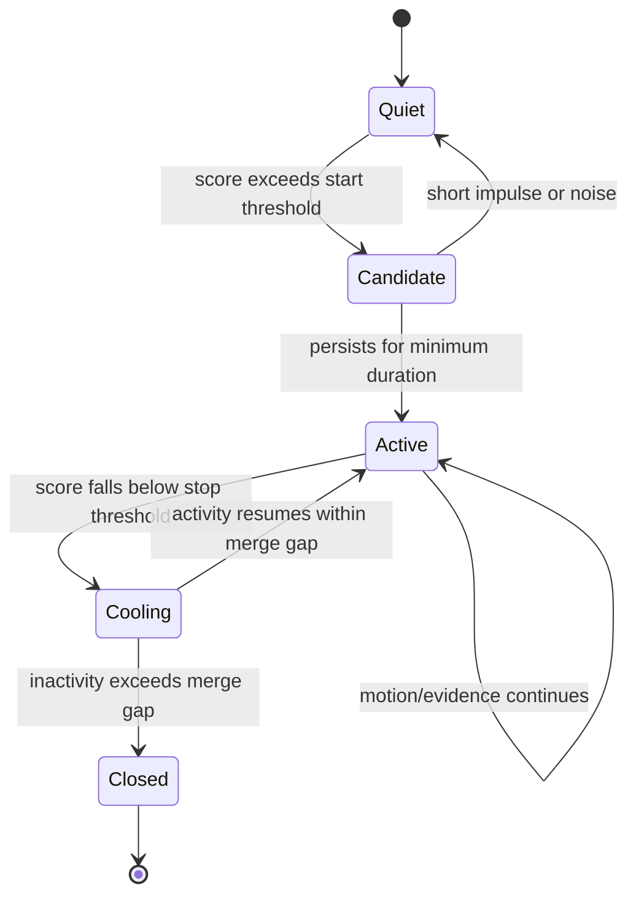
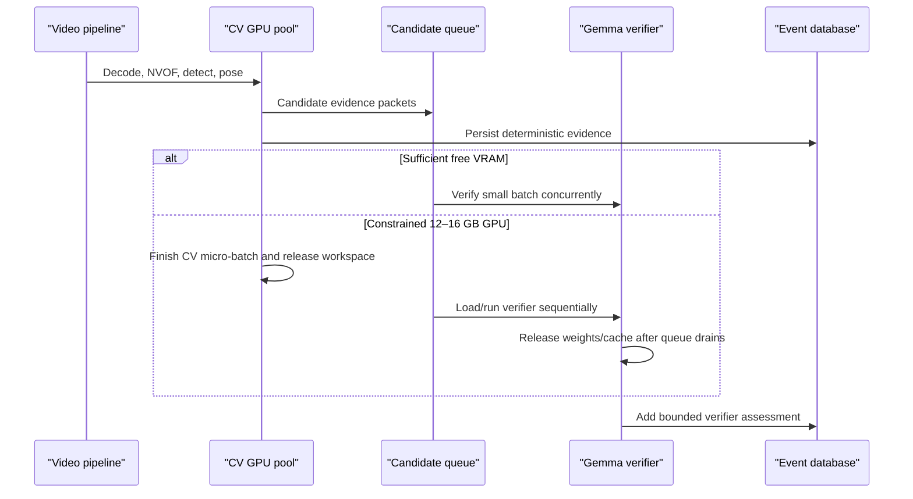
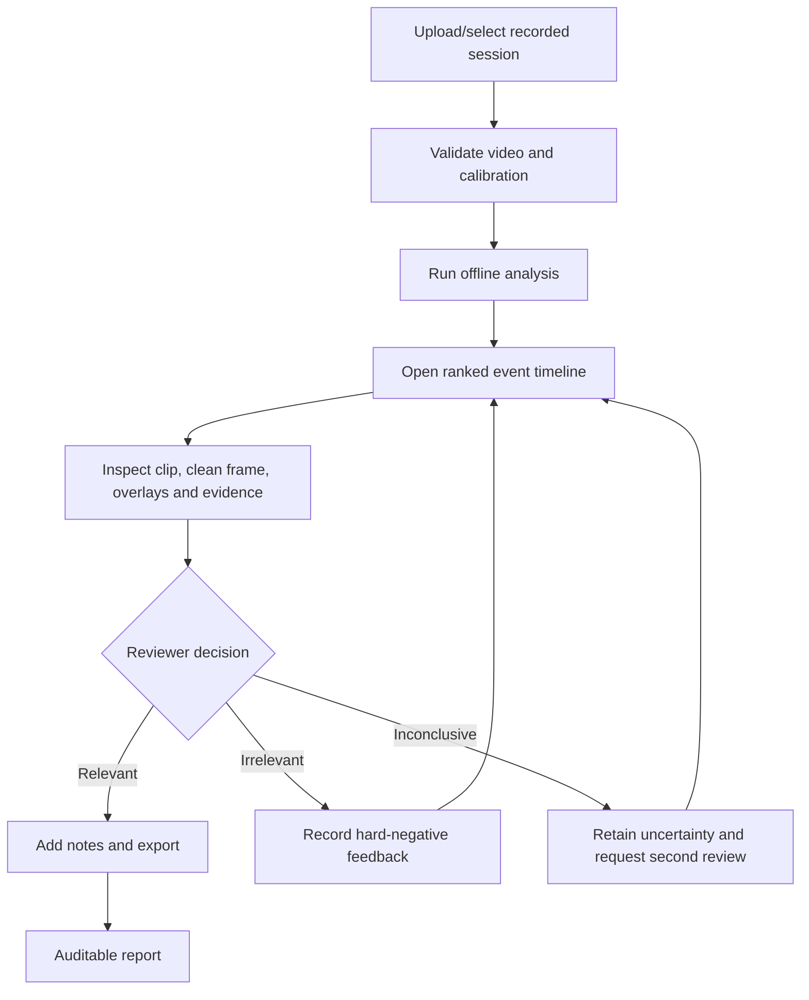
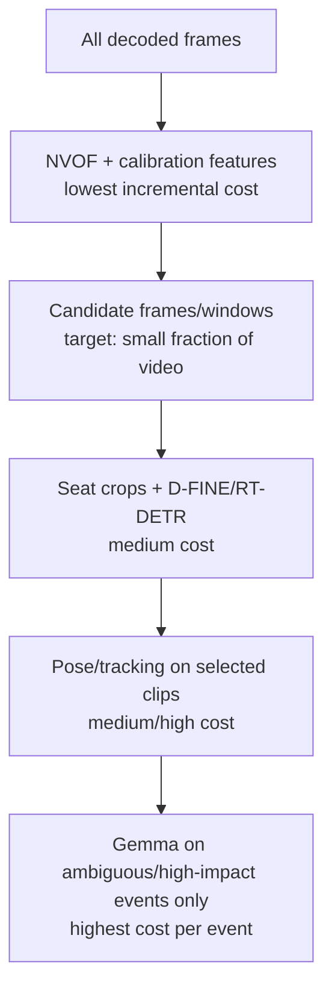

# Project Classroom
## Decision-Grade Product Requirements Document and Phase-1 Presentation Brief

**Problem Statement:** Drishti AI Hackathon 2026 — Problem Statement 2  
**Working title:** Project Classroom  
**Document status:** Proposed solution for Phase 1  
**Version:** 2.1  
**Date:** 26 July 2026  
**Team:** DataDynamo  

> **One-line pitch:** Project Classroom converts hours of recorded examination-hall footage into a short, searchable timeline of motion-grounded, seat-linked events with visual evidence and confidence—without making automated accusations.

---

## 0. Executive Decision

Project Classroom is an **offline, post-examination video investigation system**. It does not attempt to continuously “detect cheating” from individual frames. It first finds meaningful motion, localizes it to calibrated seat and desk regions, gathers multiple independent evidence streams, and then prioritizes event clips for a human reviewer.

The proposed stack is deliberately precision-first:

- **NVIDIA DeepStream + NVDEC + NVOF** for efficient video decoding and hardware optical flow.
- **Seat/desk-anchored regions** as the stable identity and localization layer.
- **D-FINE-L**, fine-tuned from pretrained Objects365 weights, as the primary small-object detector.
- **RT-DETRv2-S** as the detector challenger and fallback.
- **RTMO** as the reproducible crowded-person pose baseline.
- **Multi-HMR2** as an experimental low-frequency 3D pose/tracking challenger, not an MVP dependency.
- **DeepStream NvDCF** as the deployment tracker, compared against **Deep OC-SORT**.
- **Gemma 4 E4B instruction QAT Q4** as the default visual verifier, with scheduled model residency on constrained GPUs.
- **Gemma 4 E2B QAT Q4** as the low-memory fallback when E4B cannot preserve the required VRAM safety margin.
- **Gemma 4 12B** as an optional quality mode on suitable hardware or through sequential model residency.
- **FastAPI + React + SQLite/PostgreSQL + Roboflow Supervision** for the investigator experience, event storage, evaluation, and visual overlays.

No foundation model will be trained from scratch. We reuse pretrained models, fine-tune only the task-specific detector or temporal head where required, and validate every claimed capability on staged classroom footage.

---

## 1. Problem Statement

Examination authorities must manually inspect several hours of recorded surveillance footage to investigate incidents. Linear review is slow, tiring, inconsistent, and susceptible to missed events. Existing generic surveillance pipelines over-trigger on lighting changes and harmless motion, fail to separate overlapping activity in crowded halls, and provide little support for evidence-based review.

The problem statement requires an offline system that:

- detects temporal motion;
- identifies meaningful Regions of Interest (ROIs);
- segments long recordings into activity-based events;
- produces ROI overlays, motion heatmaps, timelines, and searchable logs;
- optionally identifies phones, paper/chits, or other prohibited objects;
- scales to long videos and multiple cameras;
- mitigates false motion, missed ROIs, segmentation errors, environmental variation, hardware/storage limitations, and data-security risks;
- retains human oversight.

### 1.1 Core product problem

The product is not “Who is cheating?” The product problem is:

> **Which short portions of this recording deserve human attention, where did the relevant activity occur, and what evidence caused the system to prioritize them?**

This distinction is essential. A suspicious action is contextual and temporal. Looking sideways, moving a hand below a desk, or holding paper can each be normal. Project Classroom therefore reports **observations and evidence**, not guilt or intent.

---

## 2. Proposed Solution

Project Classroom performs a calibrated first pass over recorded footage using hardware optical flow and seat-aware motion statistics. It converts continuous motion into candidate events. Only those candidates enter the more expensive detector, pose, tracking, temporal reasoning, and visual-verification stages.

Each final event contains:

- source video and camera identifier;
- exact start and end timestamp;
- seat/desk ROI and motion mask;
- an evidence clip with pre-roll and post-roll;
- detected object evidence, if any;
- pose and interaction evidence, if reliable;
- confidence and uncertainty indicators;
- an explanation using observational language;
- a complete audit trail to the source frames;
- human-review status and notes.

### 2.1 What the solution explicitly does not do

- It does not use facial recognition.
- It does not identify a student by name.
- It does not treat a VLM statement as ground truth.
- It does not declare that cheating occurred.
- It does not promise reliable finger-level gestures when the source pixels are insufficient.
- It does not require real-time processing for Problem Statement 2.
- It does not assume all cameras have audio or synchronized timestamps.
- It does not train a foundation model from scratch.

---

## 3. Why the Idea Is Different

### 3.1 Evidence fusion instead of a single “cheating detector”

Generic systems frequently map one model confidence directly to an alert. Project Classroom requires agreement across evidence types:

1. **Motion evidence:** Did meaningful non-global motion occur?
2. **Spatial evidence:** Which seat/desk region produced it?
3. **Object evidence:** Is a phone-like or secondary-paper-like object visible?
4. **Pose evidence:** Are head, wrist, torso, or person-to-person relationships temporally unusual?
5. **Temporal evidence:** Was the pattern sustained or repeated?
6. **Visual verification:** Does a VLM support the observational explanation, or is it uncertain?

No evidence stream is sufficient alone.

### 3.2 Seat anchoring instead of biometric identity

In a seated examination, the desk location is more stable than a generic tracking ID. Tracks are continuously reconciled with calibrated seat polygons. This:

- reduces identity switches;
- prevents one student’s motion from being assigned to a neighbour;
- allows track recovery after short occlusion;
- improves explainability;
- avoids face embeddings.

### 3.3 Hardware optical flow instead of MOG2 over-triggering

MOG2 is vulnerable to illumination changes, shadows, slowly adapting foregrounds, and compression noise. Blanket CLAHE can amplify noise and alter contrast differently across frames.

Project Classroom instead uses:

- NVOF block motion vectors;
- global camera-motion estimation;
- exposure-change detection;
- temporal median/MAD normalization per seat;
- persistent environmental-motion suppression;
- adaptive thresholds learned during calibration;
- temporal hysteresis to prevent fragmented events.

### 3.4 Selective high-resolution inference

A phone may occupy only a few pixels in the full frame. Running a detector at 640×640 over the entire classroom destroys the detail needed to distinguish it from paper.

Project Classroom:

- detects motion at full-frame scale;
- maps it to seats;
- extracts high-resolution seat/hand/desk crops;
- uses overlapping tiled inference only on candidate regions;
- accumulates evidence across adjacent frames;
- abstains when the source resolution is fundamentally insufficient.

### 3.5 Human-review optimization as the actual success criterion

The product is successful only if it reduces review time while preserving event recall. A visually impressive detector with many false alarms fails the problem.

---

## 4. End-to-End Architecture

```mermaid
flowchart LR
    A["Recorded CCTV files"] --> B["Ingest validation<br/>codec, timestamps, checksums"]
    B --> C["DeepStream NVDEC<br/>streaming decode"]
    C --> D["NVOF hardware optical flow"]
    D --> E["Global motion and exposure compensation"]
    E --> F["Seat/desk calibrated motion statistics"]
    F --> G{"Candidate event?"}

    G -- "No" --> H["Store compact motion metadata"]
    G -- "Yes" --> I["Ring-buffer clip extraction"]

    I --> J["D-FINE detector<br/>seat and desk crops"]
    I --> K["RTMO pose baseline"]
    I --> L["NvDCF / Deep OC-SORT tracking"]

    J --> M["Temporal evidence fusion"]
    K --> M
    L --> M
    F --> M

    M --> N{"Ambiguous or high-impact?"}
    N -- "No" --> O["Ranked event record"]
    N -- "Yes" --> P["Gemma visual verifier<br/>multi-frame contact sheet"]
    P --> O

    O --> Q["SQLite/PostgreSQL event store"]
    Q --> R["FastAPI"]
    R --> S["React investigator console"]
    S --> T["Human decision and feedback"]
```



### 4.1 Processing principles

- Frames are streamed; the pipeline does not extract an entire video to temporary images.
- Queues are bounded; backpressure is applied instead of allowing RAM growth.
- Only compact metadata is retained for static intervals.
- Evidence clips are generated from a ring buffer or by seeking the source video.
- Models use fixed input shapes where practical to avoid TensorRT rebuilds or `torch.compile` recompilation.
- Heavy models run on candidate clips, not on every frame.

---

## 5. Event-Generation Methodology

### 5.1 Calibration pass

For each camera, an operator performs a short setup:

1. Mark four or more floor/desk reference points.
2. Generate or correct seat and desk polygons.
3. Mark permanent exclusion regions, if required.
4. Analyse 2–5 minutes of representative footage for:
   - baseline motion per seat;
   - codec noise;
   - fan/curtain periodicity;
   - exposure behaviour;
   - typical invigilator paths.
5. Save a versioned camera calibration profile.

Calibration can be edited and audited. Automatic calibration suggestions must never silently overwrite a validated profile.

### 5.2 Motion features

Per seat and temporal window, the system derives:

- median optical-flow magnitude;
- 90th/95th percentile magnitude;
- directional coherence;
- motion area ratio;
- residual motion after global compensation;
- periodicity score;
- duration and repetition count;
- desk-zone versus upper-body-zone motion;
- neighbouring-seat correlation.

### 5.3 Robust event boundaries



The start and stop thresholds are deliberately different. This hysteresis prevents one action from being split into dozens of clips. A short pen drop can be retained as low-priority motion evidence without becoming a high-priority incident.

### 5.4 Event scoring

The score is a calibrated ranking signal, not a probability of cheating.

```text
Priority score =
  motion significance
  + temporal persistence/repetition
  + object evidence
  + pose/interaction evidence
  + cross-camera corroboration
  - global-motion likelihood
  - environmental-motion likelihood
  - uncertainty penalty
```

Weights are learned or tuned only on a held-out validation set. The UI exposes the factors contributing to each score. A VLM cannot independently create a high-priority event.

---

## 6. Model and Algorithm Decisions

### 6.1 Object detector: D-FINE with RT-DETRv2 challenger

| Candidate | Proposed role | Strength | Risk | Decision |
|---|---|---|---|---|
| D-FINE-L | Default detector | Greater localization capacity, 31M parameters, TensorRT/ONNX path, Objects365 pretrained weights | Published COCO speed does not establish exam-hall phone recall | Primary MVP and quality candidate |
| D-FINE-M | Resource-constrained detector profile | Lower compute than D-FINE-L while retaining the same detector family | May lose recall on very small or heavily occluded objects | Fallback only if end-to-end profiling requires it |
| RT-DETRv2-S | Challenger/fallback | Mature Apache-2.0 implementation, sliced inference support, broad deployment paths | May localize tiny/occluded objects less accurately than a tuned D-FINE profile | Mandatory A/B benchmark |
| Generic COCO detector | Person/initialization baseline only | Easy to reproduce | COCO “cell phone” performance does not transfer to distant CCTV | Not the final object solution |

#### Detection strategy

- Start with Objects365-pretrained weights.
- Fine-tune, do not train from scratch.
- Use seat/desk crops at a resolution preserving the object’s pixels.
- Use overlapping slices with border-aware box merging.
- Preserve multiple adjacent frames for temporal confirmation.
- Train explicit hard negatives:
  - white erasers;
  - calculators, if permitted;
  - ID cards;
  - watches;
  - pens and pen caps;
  - folded answer sheets;
  - hands and dark shadows;
  - rulers;
  - transparent stationery.

#### Phone versus chit/paper

The system must not classify all paper as suspicious because answer sheets are normal. It uses:

- object appearance;
- approximate aspect ratio and reflectance;
- location relative to hand, desk, pocket, and answer sheet;
- whether the object appears from below desk/bag/pocket;
- whether it moves between seats;
- whether the object persists across frames;
- whether screen-like reflections or phone geometry are visible;
- a separate “paper-like/uncertain” class instead of forcing “phone.”

If an object contains fewer than the minimum validated pixel footprint, the output must be **insufficient visual evidence**, not a confident label.

### 6.2 Pose

| Candidate | Proposed role | Why | Limitation |
|---|---|---|---|
| RTMO | Default crowded-person baseline | One-stage multi-person pose; avoids running a separate crop model per student | 2D keypoints remain unreliable under severe occlusion |
| RTMPose whole-body | Selective high-resolution crop analysis | Mature MMPose ecosystem; useful when a clear person crop exists | Top-down cost scales with number of people; hand pixels may be absent |
| Multi-HMR2 | Experimental challenger on candidate clips | Joint multi-person 3D human reconstruction and cross-frame tracking | New repository, limited production evidence, video path/rendering overhead, high compute |
| SAT-HMR | Research challenger for distant people | Explicit focus on scale-adaptive reconstruction | Integration and deployment maturity must be demonstrated |

The MVP does not depend on Multi-HMR2. It is evaluated on short candidate clips for:

- recovery through occlusion;
- torso and head orientation stability;
- track continuity;
- GPU memory;
- inference latency;
- failure on small/distant people.

If Multi-HMR2 does not outperform RTMO plus seat anchoring on the staged classroom set, it is excluded from the prototype.

### 6.3 Tracking

| Tracker | Role | Reason |
|---|---|---|
| DeepStream NvDCF | Deployment default | Native DeepStream integration, appearance and motion cues, GPU-friendly pipeline |
| Deep OC-SORT | A/B challenger | Strong recovery under nonlinear motion and occlusion |
| Seat reconciliation | Mandatory layer | Prevents generic tracker IDs from becoming the system’s identity truth |

Tracking IDs are session-local and non-biometric. Track-to-seat association is versioned and can be corrected by a reviewer.

### 6.4 Optional temporal action model

MMAction2/PoseC3D or RGBPoseConv3D may be tested after sufficient staged examples exist. It is not required for the first prototype.

Pure skeleton classification cannot distinguish phone from paper. If a temporal classifier is introduced, RGBPoseConv3D is preferred for evaluation because it can combine appearance and pose. It must be compared against simpler calibrated rules; it is retained only if it materially improves hall-level validation.

---

## 7. Gemma Visual Verifier and GPU-Memory Decision

### 7.1 Role of the VLM

Gemma receives only a small number of candidate events. Input is a contact sheet or short frame sequence containing:

- pre-event frame;
- event onset;
- peak motion;
- event end;
- seat/desk crop;
- detector boxes and optional clean frames;
- structured metadata such as duration and detector confidence.

The output schema is constrained:

```json
{
  "supported_observations": [
    "student's right hand moves below the desk"
  ],
  "object_assessment": "phone_like | paper_like | other | not_visible | uncertain",
  "interaction_assessment": "none | self_action | neighbouring_seat | uncertain",
  "evidence_quality": "sufficient | limited | insufficient",
  "confidence": 0.0,
  "review_note": "observational sentence without an accusation"
}
```

Gemma may re-rank an event or mark it uncertain. It may not delete source evidence, declare misconduct, or override deterministic safety rules.

### 7.2 Recommended model profiles

| Profile | Model | Intended hardware | Expected residency strategy | Decision |
|---|---|---|---|---|
| Primary/default | Gemma 4 E4B instruction QAT Q4/GGUF | 12–24 GB Ada/Blackwell or CPU+GPU hybrid | Sequential on 12 GB; measured co-residency on 16–24 GB | Default |
| Constrained fallback | `google/gemma-4-E2B-it-qat-q4_0-gguf` | 12–16 GB Ada/Blackwell or CPU+GPU hybrid | Co-resident if measured; otherwise scheduled after CV batch | Activate when E4B cannot maintain the VRAM safety margin |
| Quality mode | Gemma 4 12B Q4-compatible build | 24 GB Ada or larger | Sequential model residency preferred | Optional |
| Blackwell quality mode | `AxionML/Gemma-4-12B-NVFP4` | Blackwell with native FP4 | SGLang/ModelOpt profile after reproducibility test | Conditional |
| NVIDIA challenger | `nvidia/Phi-4-multimodal-instruct-NVFP4` | Blackwell | Optional comparison only | Not default |

### 7.3 Why AxionML Gemma-4-12B-NVFP4 is not the universal default

The checkpoint is useful, but:

- it is a third-party quantization;
- its model card targets Blackwell-class FP4 hardware;
- attention remains BF16 and the multimodal components are not fully FP4;
- the checkpoint is approximately 11 GB before runtime headroom;
- the stated SGLang deployment currently depends on specialised versions/branches;
- RTX 4070/4080/4090 are Ada GPUs and do not have native FP4 GEMM acceleration;
- 11 GB of weights does not leave safe space on a 12 GB card for KV cache, vision inputs, CUDA context, detector, pose model, TensorRT workspaces, and transient activations.

Therefore:

- **RTX 4070 12 GB:** run Gemma 4 E4B QAT Q4 sequentially after releasing detector/pose workspaces; fall back to E2B if the measured safety margin is inadequate.
- **RTX 4080 16 GB:** use E4B QAT Q4 with short context and single-request concurrency; sequential residency remains the guaranteed-safe mode until co-residency is profiled.
- **RTX 4090 24 GB:** E4B QAT Q4 is the standard profile and is a credible co-residency candidate after profiling; 12B remains an optional sequential quality mode.
- **Blackwell 24/32 GB or datacenter Blackwell:** AxionML 12B NVFP4 becomes a credible performance candidate after validation.

### 7.4 Model-residency scheduler



### 7.5 Memory rules

- Context is capped to the evidence packet; 128K/256K context is not used.
- Concurrency defaults to one verifier request per GPU.
- Input uses 4–8 selected frames, not full three-hour video.
- Generation is capped to a small structured response.
- KV cache is bounded and released between batches.
- GPU memory is measured with peak allocated and peak reserved values.
- A 15–20% VRAM safety margin is required to avoid out-of-memory crashes.
- If the VLM fails, deterministic events remain available for review.

---

## 8. Prototype for the Hackathon

### 8.1 Demonstrable prototype

The first prototype processes one recorded 1080p classroom video and demonstrates:

1. Video import and validation.
2. Manual or assisted seat/desk calibration.
3. NVOF motion visualization.
4. Seat-level motion heatmap and activity timeline.
5. Event boundary generation with pre/post-roll.
6. D-FINE or RT-DETRv2 detection on candidate crops.
7. RTMO pose overlays on selected events.
8. Seat-linked event cards.
9. Gemma E4B QAT Q4 visual verification for ambiguous events, with E2B available as the constrained fallback.
10. Search and filtering by time, seat, evidence type, score, and review status.
11. Exported annotated clip and incident-review report.
12. Human feedback: relevant, irrelevant, or inconclusive.

### 8.2 Future production prototype

- Multi-camera timestamp alignment.
- Cross-camera seat mapping and corroboration.
- NvDCF/Deep OC-SORT A/B tracking.
- TensorRT engines for detector and pose.
- Queue-based multi-video scheduling.
- Role-based access and retention controls.
- Active-learning export of hard negatives.

### 8.3 Primary investigator flow



---

## 9. Functional Requirements

| ID | Requirement | Priority | Verification |
|---|---|---:|---|
| FR-01 | Import recorded MP4/MKV footage without loading the full video into RAM | Must | Peak RAM test |
| FR-02 | Validate codec, duration, timestamps, frame rate, and file integrity | Must | Corrupt/malformed input tests |
| FR-03 | Create and version seat/desk ROI calibration | Must | Calibration save/reload test |
| FR-04 | Compute frame-to-frame motion using NVOF when supported | Must | Motion-vector overlay and metadata |
| FR-05 | Provide a software optical-flow fallback when NVOF is unavailable | Should | CPU/GPU fallback test |
| FR-06 | Compensate camera-wide motion before event generation | Must | Synthetic shake test |
| FR-07 | Suppress persistent and periodic environmental motion | Must | Fan/curtain test |
| FR-08 | Segment candidate activity into stable temporal events | Must | Event t-IoU and fragmentation |
| FR-09 | Associate events with one or more calibrated seats | Must | Seat-attribution accuracy |
| FR-10 | Detect phone-like, paper-like, and other configured objects on candidate crops | Should | AP-small and per-hour FP |
| FR-11 | Extract multi-person pose on candidate clips | Should | Person recall/keypoint stability |
| FR-12 | Preserve uncertainty when pose or object evidence is inadequate | Must | Low-resolution and occlusion tests |
| FR-13 | Generate activity heatmaps and timelines | Must | UI/export test |
| FR-14 | Produce searchable event logs | Must | Query/filter tests |
| FR-15 | Display source clip, timestamp, ROI, evidence factors, and confidence | Must | Event-card acceptance test |
| FR-16 | Run a local VLM verifier only on selected events | Should | Offline and failure-isolation tests |
| FR-17 | Never emit an automated misconduct verdict | Must | Text-policy and schema tests |
| FR-18 | Allow human relevant/irrelevant/inconclusive feedback | Must | State transition and audit test |
| FR-19 | Export an evidence report referencing immutable source timestamps | Must | Provenance test |
| FR-20 | Resume interrupted processing without duplicating events | Should | Crash/restart test |

---

## 10. Non-Functional Requirements

### 10.1 Accuracy and review quality

- Every high-priority event must contain visual evidence.
- High-priority events require either multiple evidence streams or strong sustained motion with adequate visual quality.
- The system must expose uncertainty and missing evidence.
- Threshold selection must use validation data, not demonstration footage.
- Human feedback must not silently alter previously generated results.

### 10.2 Performance

- Processing is allowed to be offline and non-real-time.
- The MVP target is **at least 1× real-time equivalent** for one 1080p stream on the target workstation after optimization; aspirational performance is faster than real time.
- A performance claim is not presentation-safe until measured end to end, including decode, inference, clip encoding, and database writes.
- Static footage must not invoke detector, pose, and VLM inference at full frame rate.

### 10.3 Reliability

- All jobs are idempotent.
- Processing checkpoints are written periodically.
- A VLM failure cannot invalidate motion/detection outputs.
- Source footage is read-only.
- Partial outputs are marked incomplete until job finalization.

### 10.4 Privacy and security

- Fully local/offline inference is the default.
- No face recognition or biometric matching.
- Encryption at rest and in transit on the local network.
- Role-based access before production deployment.
- Audit log for view, export, annotation, and deletion.
- Configurable retention for raw footage, clips, metadata, and model feedback.
- Export must contain purpose and human-review disclaimers.

---

## 11. Complete Technology Stack

| Layer | Technology | Language/runtime | Use |
|---|---|---|---|
| Video pipeline | NVIDIA DeepStream 8.x, GStreamer, NVDEC | C/C++ plugins with Python orchestration | Zero-copy decode, batching, metadata, hardware pipeline |
| Motion | DeepStream `gst-nvof`, OpenCV fallback | C++/Python | Hardware flow, compensation, ROI statistics |
| Detection | D-FINE-L; D-FINE-M fallback; RT-DETRv2-S challenger | PyTorch → ONNX → TensorRT FP16/INT8 | Person and prohibited-object evidence |
| Pose | RTMO/RTMPose; Multi-HMR2 experiment | PyTorch/TensorRT where supported | Head, wrist, torso and interaction evidence |
| Tracking | NvDCF; Deep OC-SORT benchmark | DeepStream/C++ and Python | Short/long track continuity |
| Visual verifier | Gemma 4 E4B instruction QAT Q4 default; E2B QAT Q4 fallback | llama.cpp CUDA or validated local runtime | Event verification and explanation |
| Quality verifier | Gemma 4 12B quantized | SGLang/vLLM/llama.cpp depending checkpoint | Optional higher-quality mode |
| Temporal model | MMAction2 optional | Python/PyTorch | Pose/RGB temporal benchmark |
| CV utilities | Roboflow Supervision | Python | Detections, slicing, zones, annotations, metrics |
| API | FastAPI + Pydantic | Python 3.11+ | Job, event, media, calibration, feedback APIs |
| Worker | Python multiprocessing initially; Celery/RQ later | Python | Offline job orchestration |
| UI | React + TypeScript + Vite/Next.js | TypeScript | Investigator dashboard |
| Charts | Recharts/ECharts | TypeScript | Timeline, heatmap, score and benchmark visuals |
| Database | SQLite for prototype; PostgreSQL for deployment | SQL | Sessions, cameras, events, review and audit data |
| Media storage | Local NVMe + NAS/object-compatible storage | Filesystem/S3-compatible API | Raw video, clips, thumbnails, reports |
| Packaging | Docker Compose; NVIDIA Container Toolkit | Docker | Reproducible deployment |
| Evaluation | COCO metrics, TrackEval, custom event metrics | Python | Detector, tracker and end-to-end evaluation |
| Documentation visuals | Mermaid.js | Markdown | Architecture, flows, deployment and risk visuals |

---

## 12. Hardware and Computation Feasibility

### 12.1 Deployment profiles

| Profile | GPU | System RAM | Concurrent processing assumption | VLM profile | Feasibility |
|---|---|---:|---|---|---|
| Demo/minimum | RTX 4070 12 GB | 32–64 GB | One 1080p stream/job | Gemma 4 E4B QAT Q4 sequential; E2B fallback | Feasible with bounded queues and selective inference |
| Recommended small hall | RTX 4080 16 GB | 64 GB | 1–2 streams/jobs, benchmark dependent | E4B QAT Q4 with sequential residency as safe default | Feasible |
| Recommended quality | RTX 4090 24 GB | 64–128 GB | Multiple decode streams, controlled inference concurrency | E4B QAT Q4 co-residency candidate or 12B sequential | Feasible after profiling |
| Blackwell optimized | RTX 50-series/Blackwell 24–32 GB+ | 64–128 GB | Higher throughput | NVFP4 candidates | Best fit for native FP4 |
| Medium/large center | Multi-GPU server | 128 GB+ | Queue-sharded by video/camera | Dedicated verifier GPU or scheduled pool | Feasible by horizontal workers |

The problem statement’s 64–128 GB RAM and RTX 4070–4090 range is sufficient for offline analytics, provided the implementation streams frames and controls concurrency. It is not sufficient for naively retaining decoded video or loading every model simultaneously.

### 12.2 RAM controls

- Decode surfaces remain in GPU/NVMM memory where possible.
- Host queues contain references and compact tensors, not unbounded frame lists.
- Per-stream ring buffer is time-bounded.
- Clip encoding reads from the source file or ring buffer.
- Candidate crops are released after persistence.
- Model outputs are converted to compact numeric records.
- DataLoader worker counts and prefetch factors are capped.
- Video frame extraction to disk is prohibited in the main pipeline.
- Memory-watermark monitoring pauses upstream decoding before exhaustion.

### 12.3 Storage calculation

Storage is driven by encoded bitrate, camera count, duration, and retention—not decoded frame size.

```text
Storage GB ≈ bitrate in Mbps × duration in seconds ÷ 8 ÷ 1000
```

Illustrative 3-hour recording:

| Bitrate | Per camera | 4 cameras | 8 cameras |
|---:|---:|---:|---:|
| 4 Mbps | ~5.4 GB | ~21.6 GB | ~43.2 GB |
| 8 Mbps | ~10.8 GB | ~43.2 GB | ~86.4 GB |

Operational controls:

- Keep original encoded footage; do not store decoded frames.
- Store only short evidence clips and thumbnails.
- Use lifecycle policies and deduplication by checksum.
- Separate hot NVMe processing storage from retention NAS.
- Reserve at least 20% free processing-disk capacity.
- Detect low-disk conditions before starting a job.

### 12.4 Compute cascade



The “small fraction” is a measured output, not an assumed 5–10%. The gate is optimized for event recall first; excessive filtering that misses events is unacceptable.

---

## 13. Evaluation and Benchmark Plan

### 13.1 Evaluation dataset

Create a staged internal validation corpus containing:

- 2–4 camera viewpoints;
- 15–30 seated participants if available, plus digitally or spatially varied layouts;
- normal writing, thinking, stretching, looking at a board/invigilator;
- pen drops and stationery handling;
- invigilator movement;
- phone retrieval, viewing, concealment, and passing;
- folded paper/chit retrieval and exchange;
- occlusion, entrance/exit, empty seats, and seat changes;
- low light, glare, compression, blur, camera shake, and exposure change;
- multiple simultaneous normal and staged suspicious actions.

Every event receives:

- temporal start/end;
- seat IDs;
- event type;
- visibility/quality label;
- object boxes where visible;
- reviewer confidence;
- normal/suspicious-context annotation strictly for evaluation, not automated verdict output.

Splits are made by recording session, room, or participant—not by random frames—to prevent leakage.

### 13.2 Metrics

| Layer | Metrics | Gate |
|---|---|---|
| Motion/event proposal | Event recall, event precision, temporal IoU, false events/hour, fragmentation and merge rate | Must preserve critical-event recall |
| ROI | ROI IoU, seat-attribution accuracy, multi-seat overlap correctness | No misleading single-seat attribution |
| Object detector | mAP50-95, AP-small, phone recall, paper/phone confusion, FP/hour | Threshold chosen on held-out hall |
| Pose | Person recall, PCK where labelled, missing-keypoint rate, wrist/head jitter | Unreliable keypoints must be masked |
| Tracking | HOTA, IDF1, ID switches/hour, seat switches/hour, recovery time | Seat attribution prioritized |
| VLM | Evidence-support precision, hallucination rate, abstention rate, precision lift over CV-only | Cannot reduce critical-event recall silently |
| End to end | Review-time reduction, top-K precision, missed critical events, events/hour, reviewer agreement | Human utility is final metric |
| Compute | Wall-clock throughput, peak VRAM, peak RAM, disk I/O, GPU utilization, energy/job | Profile per hardware tier |

### 13.3 Required model benchmarks

1. **D-FINE-L vs D-FINE-M vs RT-DETRv2-S**
   - full-frame inference;
   - seat-crop inference;
   - overlapping sliced inference;
   - TensorRT FP16 and INT8 where calibration quality holds.

2. **RTMO vs RTMPose vs Multi-HMR2**
   - 10, 30, and 50–60 visible people;
   - wrist/head stability;
   - occlusion recovery;
   - VRAM and wall-clock time.

3. **NvDCF vs Deep OC-SORT**
   - ID switches;
   - seat assignment;
   - disappearance/reappearance;
   - invigilator crossings.

4. **Gemma E4B vs E2B fallback vs 12B quality mode**
   - phone/paper/uncertain classification on the same event packets;
   - hallucination;
   - structured-output validity;
   - VRAM and latency;
   - CV-only versus CV+VLM precision.

### 13.4 Presentation-safe claims

The following claims require measured evidence before appearing as achieved:

- “Processes faster than real time.”
- “Reduces review time by X%.”
- “Detects phones at Y% accuracy.”
- “Supports 60 people.”
- “Runs all models simultaneously in 12 GB.”
- “Eliminates false positives.”

Until measured, they are labelled targets or hypotheses.

---

## 14. Edge-Case Analysis

| Edge case | Likely failure | System response |
|---|---|---|
| Student looks sideways briefly | False suspicious interpretation | Duration/repetition/context gate; low score |
| Student looks at board or invigilator | Head-pose false positive | Board/staff zone context; observational label only |
| Pen falls below desk | Strong brief motion | Retain low-priority motion; require corroboration for escalation |
| Student stretches | Large upper-body motion | Pose pattern plus duration; normal-action hard negatives |
| Invigilator walks through frame | Many ROIs trigger | Staff path/zone suppression plus manual “mark staff” |
| Multiple invigilators | Single-staff heuristic fails | Multi-track staff marking and dashboard override |
| Two students overlap | Pose/track identity switch | Seat anchoring, uncertainty, multi-seat event |
| Student changes seat | Seat association becomes wrong | Explicit seat-transition event and manual reconciliation |
| Empty seat with moving curtain | False seat activity | Periodicity and environmental mask |
| Sudden exposure change | Full-frame false flow | Exposure/global-change detector pauses event triggers |
| Camera bumped | Full-frame motion | Global-motion compensation; calibration invalidation warning |
| Camera permanently repositioned | Old seat map is wrong | Detect persistent homography shift; stop and require recalibration |
| Low-bitrate block artifacts | False subtle motion | Temporal median/MAD, minimum spatial coherence |
| Phone is 3–5 pixels | Confused with pen/paper | “Insufficient visual evidence”; never super-resolve into proof |
| Phone partially hidden | Missed detection | Temporal multi-frame aggregation and hand/desk crop |
| Answer sheet appears as chit | False object alert | Paper context, size/location/trajectory, hard negatives |
| Smartwatch | Tiny object not visible | Optional class only where pixel footprint supports it |
| Reflective calculator | Phone confusion | Institution configuration and hard-negative dataset |
| Simultaneous events | Merged segment | Seat-specific event state machines; allow overlapping events |
| One action pauses briefly | Over-segmentation | Cooling/merge-gap state |
| Separate actions close in time | Under-segmentation | Evidence change-point and maximum gap rules |
| Missing/corrupt frames | Timestamp drift | Decode warning, gap record, no fabricated continuity |
| Variable frame rate | Incorrect timing | Use presentation timestamps, not frame index alone |
| Unsynchronized cameras | False cross-camera inference | Per-camera results until sync confidence is sufficient |
| VLM hallucinates an object | Misleading summary | Detector/evidence constraint, uncertainty schema, human review |
| VLM server crashes | Pipeline failure | Verifier optional; deterministic record remains valid |
| GPU out of memory | Job crash | Memory watermark, sequential residency, retry at smaller profile |
| Disk fills | Lost output | Preflight quota and safe job pause |
| Power/server failure | Partial result | Checkpointed stages, idempotent resume, immutable source |

---

## 15. Risk Register and Mitigation

### 15.1 Problem-statement risks

| Risk | Probability | Impact | Detection/metric | Mitigation | Residual risk |
|---|---:|---:|---|---|---|
| False motion from noise/shadows | High | Medium | False events/hour | NVOF, temporal robust statistics, exposure/global-motion suppression | Complex reflections remain difficult |
| Missed subtle ROI | Medium | High | Critical-event recall | Seat-specific thresholds, multi-frame accumulation, motion+pose evidence | Source pixels may be insufficient |
| Over-segmentation | High | Medium | Fragments per ground-truth event | Hysteresis, cooling state, merge gap | Long interrupted actions may still split |
| Under-segmentation | Medium | Medium | Merged-event rate | Seat-specific states, change-point rules | Interacting students may form one event |
| Camera vibration | Medium | High | Global-flow ratio | Homography/affine compensation and recalibration detection | Severe blur cannot be reversed |
| Storage constraints | High | Medium | GB/session and free disk | Preserve encoded video, evidence-only clips, retention policy | Institutional retention may still be costly |
| Processing delays | Medium | Medium | Wall-clock/video-hour | Hardware decode/flow, selective inference, TensorRT | Poor-quality video may create more candidates |
| ROI localization error | Medium | High | ROI IoU and seat attribution | Seat calibration, detector/pose fusion, multi-seat uncertainty | Dense occlusion remains |
| Environmental variability | High | High | Leave-one-hall-out performance | Per-camera calibration, domain augmentations, configurable thresholds | Revalidation needed per institution |
| Unauthorized data access | Medium | Critical | Audit/security tests | Offline default, RBAC, encryption, retention, access logs | Insider misuse requires governance |
| Hardware failure | Medium | High | Job recovery test | Checkpoint/resume, checksums, NAS backup, health monitoring | Camera-side footage loss may be unrecoverable |
| Scalability bottleneck | Medium | High | Throughput/camera | Stateless workers, queues, per-video sharding | GPU capacity planning remains site-specific |

### 15.2 Additional model and product risks

| Risk | Why it matters | Mitigation |
|---|---|---|
| Detector domain shift | COCO/Objects365 phones are larger and clearer than CCTV phones | Fine-tune pretrained weights; hall/session split; hard negatives; AP-small |
| Synthetic-data gap | Composited objects may not match real occlusion/lighting | Use synthetic data only as support; validate on real staged footage |
| VLM hallucination | Fluent explanations can be mistaken for evidence | Structured schema, evidence references, abstention, human decision |
| Quantization degradation | Q4/NVFP4 may alter fine visual judgments | Compare against BF16/FP16 on a fixed validation set |
| Unsupported hardware precision | NVFP4 on Ada gives no native FP4 benefit | Hardware-aware profile; QAT Q4/INT4 fallback |
| New-model reproducibility | Gemma 4 and Multi-HMR2 stacks are recent | Pin versions, containerize, maintain stable baseline |
| Identity misattribution | Wrong seat association has serious consequences | Seat-first identity, multi-seat label, manual correction, no names |
| Alert fatigue | Too many “possible events” recreates manual review | Optimize false events/hour and Precision@K, not only frame accuracy |
| Automation bias | Reviewer may trust ranked events too much | Prominent uncertainty, randomized audit samples, training and policy |
| Missed-event tunnel vision | Reviewer may inspect only system events | Sample unflagged intervals for quality control |
| Feedback poisoning | Incorrect reviewer labels degrade future tuning | Dual review for training labels, immutable original feedback |
| Privacy overreach | Tool could be repurposed for continuous surveillance | Offline post-hoc scope, access controls, purpose limitation |
| Dataset consent/licensing | Classroom data involves students and may be restricted | Staged consenting adults for prototype; provenance register |
| Model/license change | Community checkpoints may have unclear or changing terms | Prefer official Apache-2.0 models; pin and archive licence text |

### 15.3 Fail-safe behaviour

When confidence is inadequate, Project Classroom must:

- retain the clip if motion is meaningful;
- label the evidence as limited or insufficient;
- avoid object or intent claims;
- allow a reviewer to inspect the clean source;
- log the reason for uncertainty.

---

## 16. Traceability: Challenge to Design Response

| Problem-statement challenge | Design response | Proof required |
|---|---|---|
| Crowded examination halls | Seat polygons, RTMO, NvDCF/Deep OC-SORT, overlapping seat events | 50–60-person staged or representative benchmark |
| Subtle motion | NVOF residual flow, seat-specific robust baseline, pose deltas | Recall on head/hand/object exchanges |
| Camera noise | Temporal robust statistics and coherence filters | Compression/noise stress test |
| Lighting variations | Exposure-change detection; no blanket CLAHE | Glare/brightness test |
| Camera vibration | Global motion compensation and recalibration warning | Synthetic/real shake test |
| Long video duration | Streaming decode, bounded queues, selective cascade | 3-hour soak test |
| ROI boundary accuracy | Seat calibration plus detector/pose/flow fusion | ROI IoU and seat attribution |
| Background motion | Persistent/periodic motion model and masks | Fan/curtain test |
| Event segmentation quality | Per-seat hysteresis state machines | Temporal IoU, split/merge rate |
| Multi-camera synchronization | Timestamp confidence, manual offset, visual event correlation | Known-offset test |
| Scalability | Stateless jobs, GPU-aware scheduling, metadata-first storage | Multi-job load test |
| False event generation | Multi-evidence fusion, calibrated score, VLM only as verifier | False events/hour |
| Object identification | High-resolution crops, D-FINE/RT-DETR, temporal confirmation | AP-small and confusion matrix |
| Heatmaps/timelines/logs | Supervision overlays, React charts, event database | UI acceptance test |
| Human oversight | No verdict; evidence and reviewer workflow | Language/schema audit |

---

## 17. Feasibility Analysis

### 17.1 Technical feasibility

**Feasible for a hackathon prototype** because:

- the system processes recorded files and has no hard real-time deadline;
- DeepStream supplies production-oriented decode, metadata, tracking, and optical-flow primitives;
- D-FINE and RT-DETR provide pretrained and exportable detectors;
- RTMO provides a reproducible pose baseline;
- Gemma offers local multimodal models at multiple sizes;
- the UI and evidence workflow can be built independently of final model tuning.

**Not yet proven for production** because:

- tiny phone/paper visibility depends on camera placement and source resolution;
- no public dataset fully represents this deployment;
- 50–60-person pose/tracking and multi-camera performance require measured validation;
- false-positive costs are high;
- privacy, retention, and institutional procedures require governance.

### 17.2 Operational feasibility

The workflow matches how investigation teams operate: ingest footage, review ranked events, record a decision, and export an audit artifact. One-time camera calibration is an operational cost but materially improves reliability.

### 17.3 Economic feasibility

The architecture uses the target RTX 4070–4090 range rather than assuming datacenter GPUs. Hardware optical flow and selective inference reduce GPU-hours. Storage remains the larger long-term cost and is controlled through encoded-video retention and evidence-only derivatives.

### 17.4 Data feasibility

No foundation-model training is needed. The main data requirement is a small, high-quality validation and fine-tuning corpus for:

- phone/paper-like object detection;
- event thresholds;
- hard-negative mining;
- optional temporal classification.

This is feasible using consenting staged recordings, but production generalization remains a deployment gate.

### 17.5 Feasibility verdict

| Capability | Phase-1 confidence | Production confidence | Decision |
|---|---:|---:|---|
| Offline ingest and motion timeline | High | High | Build |
| Seat/desk ROI heatmap | High | High after calibration | Build |
| Event clip segmentation | High | Medium-high | Build and benchmark |
| Crowded pose overlay | Medium-high | Medium | RTMO baseline |
| Reliable phone/paper distinction | Medium | Low-medium until data | Prototype with explicit abstention |
| Multi-HMR2 across 50–60 people | Low-medium | Unknown | Research experiment |
| VLM evidence verification | Medium-high | Medium | Gemma E4B QAT Q4 default; E2B fallback |
| Fully automated misconduct decision | Unacceptable | Unacceptable | Explicitly excluded |

---

## 18. APIs and Data Surfaces

| Method | Path | Purpose |
|---|---|---|
| POST | `/api/sessions` | Register a recorded examination session |
| POST | `/api/sessions/{id}/videos` | Register source video and metadata |
| POST | `/api/cameras/{id}/calibrations` | Save a versioned seat/desk calibration |
| POST | `/api/jobs` | Start an offline analysis job |
| GET | `/api/jobs/{id}` | Read stage progress, resource use, and errors |
| POST | `/api/jobs/{id}/cancel` | Safely stop after the current checkpoint |
| GET | `/api/events` | Filter events by session, time, seat, evidence, score, review |
| GET | `/api/events/{id}` | Fetch event evidence and provenance |
| GET | `/api/events/{id}/clip` | Stream clean or annotated evidence clip |
| POST | `/api/events/{id}/reviews` | Record relevant/irrelevant/inconclusive review |
| GET | `/api/sessions/{id}/heatmap` | Return calibrated motion/activity heatmap data |
| POST | `/api/sessions/{id}/reports` | Generate an investigator report |
| GET | `/api/benchmarks/{id}` | Read evaluation and compute results |

Core entities:

- Session
- Camera
- SourceVideo
- CalibrationProfile
- SeatRegion
- AnalysisJob
- MotionWindow
- Track
- Detection
- PoseObservation
- Event
- EvidenceArtifact
- VLMVerification
- HumanReview
- AuditEntry
- BenchmarkRun

---

## 19. Investigator Experience

### 19.1 Screens

1. **Sessions:** source videos, duration, cameras, analysis status.
2. **Calibration:** camera view, seat polygons, exclusions, homography.
3. **Processing:** stage progress, throughput, RAM/VRAM, warnings.
4. **Timeline:** motion intensity and event markers per seat/camera.
5. **Event review:** clean clip, annotated clip, evidence factors, uncertainty.
6. **Heatmap:** spatial distribution with time and evidence filters.
7. **Search/log:** timestamp, seat, evidence type, score, status.
8. **Benchmarks:** precision/recall, false events/hour, compute usage.
9. **Report/export:** selected events and reviewer conclusions.

### 19.2 UI language rules

Allowed:

- “Phone-like object visible near right hand; evidence limited.”
- “Repeated head turn toward neighbouring desk over 14 seconds.”
- “Motion detected below Desk A-12; object not visible.”

Disallowed:

- “Student cheated.”
- “Confirmed malpractice.”
- “Guilty.”
- “This person is suspicious.”

---

## 20. Implementation Process

### Phase A — Three-hour presentation preparation

1. Finalize this PRD and architecture visuals.
2. Convert Sections 1–7 and 12–17 into a 10–12-slide deck.
3. Show the solution as a calibrated investigation assistant, not a cheating oracle.
4. Include the model decision matrix and hardware-aware Gemma decision.
5. Mark prototype versus production capabilities explicitly.

### Phase B — Prototype

1. Assemble one representative video and annotations.
2. Build DeepStream ingest and NVOF overlay.
3. Implement seat calibration and per-seat event state machine.
4. Integrate D-FINE-L and RT-DETRv2-S on seat crops.
5. Add RTMO pose evidence.
6. Build event store, API, and React timeline.
7. Add Gemma E4B QAT Q4 verifier with strict JSON output and an E2B fallback profile.
8. Run the first end-to-end benchmark.

### Phase C — Accuracy iteration

1. Mine false positives.
2. Fine-tune detector from pretrained weights.
3. Compare NvDCF and Deep OC-SORT.
4. Test Multi-HMR2 only on candidate clips.
5. Calibrate event scoring.
6. Evaluate VLM precision lift and hallucination.

### Phase D — Deployment hardening

1. TensorRT export and profiling.
2. Checkpoint/retry and multi-job scheduling.
3. RBAC, encryption, audit, retention.
4. Multi-camera sync and cross-camera event correlation.
5. Independent privacy, fairness, and security review.

---

## 21. Phase-1 Presentation Structure

| Slide | Title | Content/visual |
|---:|---|---|
| 1 | Project Classroom | One-line pitch and offline investigation positioning |
| 2 | The review problem | Hours of footage → missed events, fatigue, no searchable evidence |
| 3 | Our idea | Motion-grounded, seat-linked, multi-evidence event prioritization |
| 4 | How it works | Mermaid end-to-end architecture |
| 5 | Why existing approaches fail | MOG2/scene cuts/full-frame detector/single-model weaknesses |
| 6 | Precision innovations | Seat anchoring, NVOF, tiled detection, temporal fusion, abstention |
| 7 | Model stack | D-FINE vs RT-DETR; RTMO/Multi-HMR2; NvDCF/Deep OC-SORT |
| 8 | Gemma verifier | E4B QAT Q4 default, E2B fallback, 12B quality mode, hardware-aware memory scheduler |
| 9 | Prototype experience | Calibration → timeline → evidence card → human decision |
| 10 | Feasibility and compute | Hardware tiers, streaming memory design, storage calculation |
| 11 | Risks and mitigation | Top risks with measurable controls; human oversight |
| 12 | Validation and roadmap | Metrics, benchmarks, MVP, production gates |

### 21.1 Recommended hero statement

> **We do not automate accusations. We automate the search for evidence.**

### 21.2 Recommended innovation statement

> Project Classroom is not another detector running on every frame. It is a hardware-aware evidence cascade that understands where each student is seated, spends computation only where activity occurs, and explicitly abstains when the footage cannot support a conclusion.

---

## 22. Acceptance Criteria for the First Prototype

- [ ] A recorded video can be imported and validated without loading it fully into memory.
- [ ] An operator can create and save seat/desk polygons.
- [ ] The system displays NVOF or fallback motion vectors and a seat-level heatmap.
- [ ] The system creates event clips with correct source timestamps.
- [ ] One sustained action is not fragmented beyond the configured tolerance.
- [ ] Camera shake and exposure-change tests do not create high-priority incidents.
- [ ] D-FINE-L and RT-DETRv2-S can be evaluated on the same crop dataset.
- [ ] Object output includes phone-like, paper-like, other, and uncertain states.
- [ ] Low-pixel objects are marked insufficient rather than confidently classified.
- [ ] RTMO pose output is tied to calibrated seats.
- [ ] Tracker identity is corrected/reconciled by seat.
- [ ] Gemma E4B QAT Q4 produces valid structured output on at least 95% of verifier calls.
- [ ] A Gemma failure does not remove the deterministic event record.
- [ ] The dashboard searches by time, seat, evidence, and review status.
- [ ] A reviewer can label an event relevant, irrelevant, or inconclusive.
- [ ] Exported evidence links back to the immutable source timestamp.
- [ ] Peak RAM and VRAM are recorded for every benchmark.
- [ ] No screen or report states that cheating is confirmed.

---

## 23. Known Gaps

- Reliable phone/chit detection cannot be guaranteed until camera-resolution and pixel-footprint requirements are validated.
- Multi-HMR2 has not yet been reproduced on the target 50–60-person exam footage.
- Multi-camera synchronization remains dependent on source timestamp quality and per-site calibration.
- No public dataset found so far fully covers this problem with clean provenance and adequate seated micro-actions.
- Gemma 4 quantized runtime support is evolving; versions must be pinned and tested.
- The proposed throughput and memory profiles are engineering targets until measured on the target workstation.
- Legal consent, retention, and review policy are institution-specific and require formal approval before deployment.

---

## 24. Research and Reference Register

| Reference | What it establishes | How Project Classroom uses it |
|---|---|---|
| [Official Drishti AI Hackathon problem statement](</Users/atharvadeo/Desktop/drishti/Problem Statement DrishtiAI Hackathon.pdf>) | Requirements, risks, hardware range, and human-oversight mandate | Primary scope and traceability baseline |
| [NVIDIA DeepStream 8.0 documentation](https://docs.nvidia.com/metropolis/deepstream/8.0/index.html) | GPU-accelerated streaming, inference, metadata, tracking, and plugins | Core offline video pipeline |
| [DeepStream `gst-nvof`](https://docs.nvidia.com/metropolis/deepstream/dev-guide/text/DS_plugin_gst-nvof.html) | Hardware optical flow from Turing/Jetson Orin onward; 4×4 block vectors | Primary motion-estimation layer |
| [NVIDIA TensorRT support matrix](https://docs.nvidia.com/deeplearning/tensorrt/latest/getting-started/support-matrix.html) | Hardware and precision compatibility | Prevents invalid FP4/engine portability claims |
| [TensorRT-RTX precision guidance](https://docs.nvidia.com/deeplearning/tensorrt-rtx/latest/performance/best-practices.html) | FP4 is natively supported on Blackwell, not Ada | Basis for Gemma NVFP4 hardware decision |
| [D-FINE official repository](https://github.com/Peterande/D-FINE) | ICLR 2025 detector, pretrained models, TensorRT/ONNX deployment | Primary detector candidate |
| [RT-DETR/RT-DETRv2 official repository](https://github.com/lyuwenyu/RT-DETR) | Real-time DETR baseline, custom training, sliced inference, TensorRT | Detector challenger/fallback |
| [MMPose](https://github.com/open-mmlab/mmpose) | Pose framework including RTMPose and RTMO | Reproducible pose baseline |
| [Multi-HMR2](https://github.com/naver/multi-hmr2) | Multi-person 3D reconstruction and video tracking | Experimental candidate on selected clips |
| [SAT-HMR](https://github.com/ChiSu001/SAT-HMR) | Scale-adaptive multi-person reconstruction | Distant-person research challenger |
| [OC-SORT](https://github.com/noahcao/OC_SORT) | Observation-centric tracking under occlusion/nonlinear motion | Tracker benchmark lineage |
| [Deep OC-SORT](https://github.com/GerardMaggiolino/Deep-OC-SORT) | Appearance-assisted OC-SORT | A/B challenger to NvDCF |
| [MMAction2](https://github.com/open-mmlab/mmaction2) | Pose/RGB temporal action-recognition framework | Optional temporal classifier evaluation |
| [Roboflow Supervision](https://github.com/roboflow/supervision) | Detection structures, slicing, zones, annotations, evaluation utilities | UI overlays, crops, zones, metrics—not core intelligence |
| [Google Gemma 4 12B model card](https://huggingface.co/google/gemma-4-12B-it) | Native image/video understanding and model capabilities | Quality-mode visual verifier |
| [Google Gemma 4 E4B](https://huggingface.co/google/gemma-4-E4B) | Mid-sized multimodal Gemma option with native image/video understanding | Default verifier family; use an instruction-tuned QAT Q4/GGUF build after runtime validation |
| [Google Gemma 4 E2B QAT Q4 GGUF](https://huggingface.co/google/gemma-4-E2B-it-qat-q4_0-gguf) | Official lower-memory quantization-aware checkpoint | Constrained-GPU fallback verifier |
| [AxionML Gemma-4-12B-NVFP4](https://huggingface.co/AxionML/Gemma-4-12B-NVFP4) | Approximately 11 GB MLP-only NVFP4 checkpoint targeting Blackwell | Conditional Blackwell quality profile |
| [NVIDIA Phi-4 multimodal NVFP4](https://huggingface.co/nvidia/Phi-4-multimodal-instruct-NVFP4) | NVIDIA-quantized 5.6B multimodal alternative | Optional NVIDIA runtime comparison |
| [DVR-Scan](https://github.com/Breakthrough/DVR-Scan) | Classical motion-event detection for surveillance videos | External baseline for event segmentation |
| [Cheatomaly](https://doi.org/10.3389/fdata.2026.1817120) | Temporal weakly supervised exam anomaly research | Supports temporal, not single-frame, evaluation direction |
| [PySceneDetect](https://www.scenedetect.com/) | Shot/cut/fade detection | Explicitly rejected as the main activity segmenter |

---

## 25. Final Recommendation

Build the Phase-1 story around a credible, bounded proposition:

> **Project Classroom is an offline evidence-prioritization system for examination footage. Hardware optical flow finds where and when activity occurs; seat-aware detection, pose, and tracking explain it; a compact Gemma verifier handles ambiguity; and a human makes every final decision.**

For the initial stack:

1. Use **DeepStream + NVOF** for ingest and motion.
2. Use **D-FINE-L** as the primary detector, **D-FINE-M** as a measured resource fallback, and **RT-DETRv2-S** as the mandatory challenger.
3. Use **RTMO** as the MVP pose model.
4. Use **NvDCF with seat reconciliation**, benchmarked against **Deep OC-SORT**.
5. Use **Gemma 4 E4B instruction QAT Q4** as the default verifier, scheduled sequentially on 12 GB and profiled for co-residency on 16–24 GB GPUs.
6. Retain **Gemma 4 E2B QAT Q4** as the constrained fallback and reserve **Gemma 4 12B** for a measured quality profile or Blackwell deployment.
7. Keep **Multi-HMR2** as a clearly labelled experiment until its 50–60-person feasibility is demonstrated.
8. Optimize and present **review-time reduction, event recall, false events/hour, and uncertainty quality**—not generic model accuracy.

This proposal addresses every objective and named risk in the problem statement while remaining honest about the unsolved parts: source-resolution limits, domain data, crowded tracking, and the difference between prioritizing evidence and proving misconduct.
