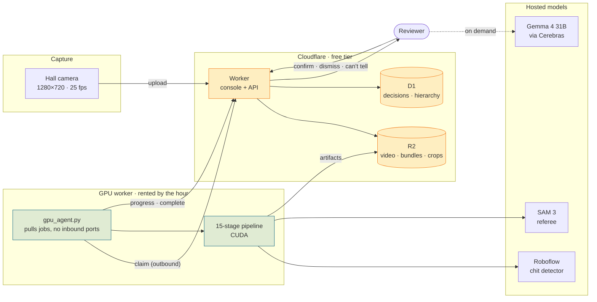
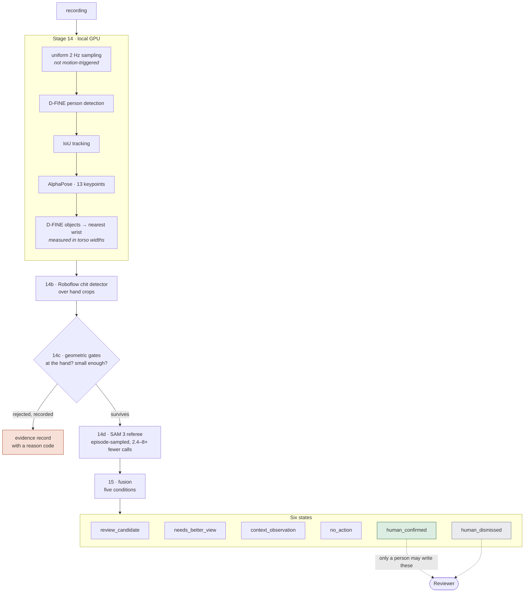
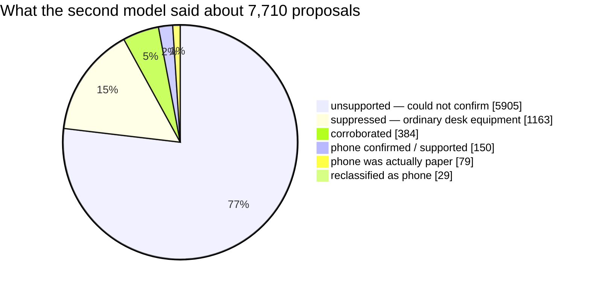
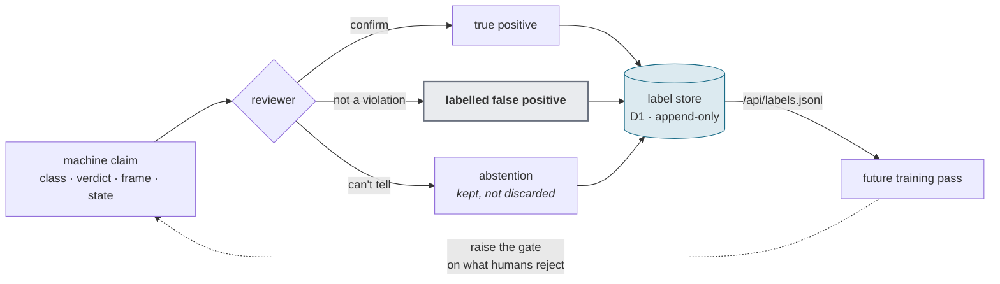

<div align="center">

# Drishti · Project Classroom

**CCTV review for computer-based exam centres.**
It finds moments worth a human's attention. It never decides that anyone cheated.

[](docs/OUTPUT_CONTRACT.md)
[](docs/OUTPUT_CONTRACT.md)
[](tests/)
[](https://drishti-console.drishti-console.workers.dev)

</div>

---

## The one-paragraph version

A hall of 200 candidates on computers, one ceiling camera, and a proctor who
cannot watch everyone. This system watches the recording, tracks every person,
and asks one narrow question per person: *was something held near their hands
that is not ordinary desk equipment?* When two independent models agree, it puts
one frame in front of a human and asks them to decide. When it cannot tell — and
on this corpus it usually cannot — **it says so, loudly, instead of guessing.**

Of 593 people tracked across five recordings, it routed **6** to review and
abstained on **567**. That 96% abstention rate is the headline, not a gap to
read past.

---

## Why abstention is the design, not a failure

Every proctoring system faces the same asymmetry:

|  | Cost |
| --- | --- |
| Missing a cheat | one candidate gains an unfair advantage |
| Falsely accusing a candidate | a person's exam, and possibly their year, is destroyed on the word of a model that saw 40 blurry pixels |

These are not symmetric, so the system is not tuned symmetrically. Four rules
are enforced in code, not by convention:

1. **No raw count is ever presented as a cheating rate.**
2. **Nobody is ever ranked by number of detections.**
3. **Abstentions are never hidden.** "Could not tell" is a first-class output with its own state.
4. **No probability of cheating is ever emitted.** The system has no such quantity.

`pipeline/fusion.py` raises if code tries to write `human_confirmed` or
`human_dismissed` — those two states may only come from a person clicking a
button. That is the whole architecture in one assertion.

---

## Architecture



**The GPU pulls; nothing pushes to it.** Every arrow out of the GPU box is
outbound HTTPS, so there is no port to forward, no static IP and no tunnel to
keep alive. A machine behind a campus NAT — or a cloud instance that exists for
forty minutes — runs this unchanged.

---

## The pipeline



**Detectors propose. SAM 3 verifies. Neither judges.**

Records are never deleted, only annotated. A rejected detection keeps its
reason code, which is what makes precision and recall computable later —
once ground truth exists.

### The five fusion conditions

Each is a yes/no question with its arithmetic attached, shown to the reviewer
on demand:

| Condition | The question a reviewer reads |
| --- | --- |
| `proposal_survives_geometry` | Was the object at their hand, and small enough? |
| `sam3_supports_or_cannot_exclude` | Did the second model back it up? |
| `associated_with_this_person` | Was it this person's, not a neighbour's? |
| `lasts_or_recurs` | Did it last, or keep happening? |
| `no_dominant_equipment_explanation` | Ruled out ordinary desk equipment? |

---

## What was actually measured

Everything below is counted from committed run artifacts. Nothing here is an
accuracy claim — see [the honest limits](#the-honest-limits).

### The funnel, five recordings, 10m 55s of footage

| Recording | Tracked | → review | abstained | context |
| --- | ---: | ---: | ---: | ---: |
| Hall 3 · paper handling | 236 | 3 | 217 | 16 |
| Hall 4 · mobile usage | 167 | 1 | 166 | 0 |
| Hall 5 · talking | 92 | 0 | 90 | 2 |
| Hall 1 · phone | 84 | 2 | 80 | 2 |
| Hall 6 · phone (10s clip) | 14 | 0 | 14 | 0 |
| **Total** | **593** | **6** | **567** | **20** |

### SAM 3 as referee — 7,710 adjudications



Two numbers matter here:

- **15.1% suppressed as desk equipment.** The referee is doing real work
  killing keyboards, mice and monitors that the detector proposed as objects
  of interest. Those are the hard negatives.
- **5.4% backed the object claim.** The rest is the system refusing to
  confirm, which routes to `needs_better_view` — *not confirmed*, never
  *absent*.

`unsupported` means **not confirmed**. It does not mean nothing was there.
SAM 3 missed known true positives on this corpus, which is exactly why it can
suppress a candidate but can never clear one.

### The honest limits

> **There is no accuracy figure for this system, and this README will not
> invent one.**

Watching the footage by eye, the impression is that the detectors surface
nearly every genuine incident and bury it in false positives. That impression
is consistent with the 96% abstention rate and the 76.6% `unsupported` share —
but **an impression is not a benchmark**, and reporting it as one would be the
exact failure the output contract exists to prevent.

What is missing to turn it into a real number:

- [ ] Frame-level ground truth on the corpus, labelled by someone who is not the author
- [ ] A held-out split the thresholds were never tuned against
- [ ] Precision/recall computed per lane, with the abstentions counted honestly rather than dropped
- [ ] Inter-rater agreement between two human reviewers on the same clips

Until those exist, the deliverable is a **queue ordered by evidence**, not a
detector with a score. Every record needed to compute those metrics is already
being written — that is what the reason codes are for.

---

## Learning from the reviewer

Every decision is stored append-only. A reviewer who changes their mind writes
a second row; the first stays, because *confirmed then dismissed* is a more
informative example than either answer alone.



**The dismissals are the valuable half.** A detection nobody disputes teaches
little. A detection the machine made, a human overturned, and which still
carries the machine's original claim — class, SAM 3 verdict, frame, confidence
— is a labelled hard negative, and hard negatives are what a 76.6%
`unsupported` rate needs.

To be precise about the method: this is **supervised learning from human
feedback on a fixed corpus**, not reinforcement learning. There is no policy
taking actions in an environment and no reward signal being optimised online.
Calling it RL would oversell it. The realistic first pass is re-tuning the
geometric gates and the SAM 3 prompt against the accumulated labels, then
fine-tuning the chit detector on the confirmed/dismissed crops.

Export the whole label set, reversals included:

```bash
curl https://drishti-console.drishti-console.workers.dev/api/labels.jsonl
```

---

## The console

One person, one screen, one decision.

| Screen | What it is for |
| --- | --- |
| **Overview** | the run at a glance, and uploading a recording |
| **Review** | one candidate at a time — picture first, three keys, auto-advance |
| **Video** | wipe player, findings table, per-person isolation |
| **Not violations** | the labelled false-positive set, exportable |

**Review keys:** `1` confirm · `2` not a violation · `3` can't tell · `w` show
the reasoning · `g` ask Gemma · `n`/`p` next and previous.

Three things it deliberately does:

- **Shows the picture before the reasoning.** The arithmetic is folded away,
  because the working is what you check *after* the image surprises you.
- **On a SAM-supported frame, draws only the supported box.** The other
  proposals are equipment context and drawing them buries the one box the
  reviewer is being asked about.
- **Names people `Person #118 · unattributed`.** Seat calibration is
  unapproved on every profile but one, so the console never implies that
  `#118` means seat 118.

### Looking away is a separate condition

Measured on its own criteria — a turn held ≥3s, or ≥4 turns inside 20s —
against **that person's own baseline**, and it can never route someone to
review by itself. Head direction is four-way and coarse. **It is not gaze**,
and gaze is not recoverable at this source scale.

---

## What we tried, and what we rejected

| Tried | Outcome |
| --- | --- |
| Motion-triggered sampling (run 1446) | **Rejected.** Looked at 20–39% of each recording; a candidate who sits still was never observed. Replaced by uniform sampling. |
| Ranking review frames by detector confidence | **Rejected.** Put a 0.90 shirt above a 0.55 verified phone. Ranking is now by SAM 3's verdict first. |
| Corroboration as a fixed count (≥3 frames) | **Replaced by count OR rate.** A pure 2/3 rate deleted all three true positives on the paper run — track 118 was 5 of 19 frames (26%). |
| Blend slider for the annotated overlay | **Rejected.** At 50% opacity you cannot tell our box from the desk bezel. Replaced by a hard wipe. |
| Showing Gemma the annotated crop | **Rejected.** It described our own drawn rectangle back as "a small, orange-bordered rectangular object". It now gets the clean crop. |
| 16-way concurrency on the Roboflow calls | **Rejected.** Lost 2,937 of 3,439 calls to rate limiting. Held at ~6. |
| COCO `cell phone` routing to review | **Rejected.** It is workstation context only. The phone route runs through SAM 3 naming it. |
| Drawing all 236 tracked people on the video | **Rejected.** Identical picture whether a run found one thing or nothing. Now draws only people with findings. |

Several of these were caught only by rendering the output and looking at it.
That is the working method: **render before believing counts.**

---

## Running it

### Locally

```bash
cd console
npm install
npm run dev          # API on :5179, console on :5178
```

SQLite by default. The server prints the database path it opened — a mistyped
`DRISHTI_DB` otherwise opens a different, empty database, and an empty project
list is indistinguishable from "nobody has created anything yet".

### The GPU worker

```bash
export DRISHTI_CONSOLE=https://drishti-console.drishti-console.workers.dev
export ROBOFLOW_API_KEY=<key>
python -c "import torch; print(torch.cuda.is_available())"   # do not skip
python tools/gpu_agent.py --once
```

Always `--once` first: one job, so a wiring mistake surfaces on one recording
rather than on the whole queue.

Full deployment runbook: **[docs/DEPLOYMENT.md](docs/DEPLOYMENT.md)**

---

## Repository map

| Path | What lives there |
| --- | --- |
| `pipeline/` | the stages, the reason codes, the fusion policy machine |
| `tools/` | run drivers, bundlers, the GPU agent |
| `console/src/` | React review console |
| `console/server/` | Node API — SQLite or Postgres |
| `console/worker/` | the same API on Cloudflare — D1 and R2 |
| `docs/OUTPUT_CONTRACT.md` | **frozen v1.0.0.** Read before changing what this reports |
| `tests/` | 63 tests, 27 of them contract invariants |

`console/server/routes.js` is shared by the Node server and the Worker.
Two copies would drift, and the first thing to drift would be the decision
vocabulary — the one part that must not.

---

## Status

**Working:** the 15-stage pipeline on GPU · the review console · decisions
persisted append-only · upload → job → GPU → artifacts → console, verified end
to end · deployed on Cloudflare with D1 and R2.

**Not done:** no authentication on the console or the job queue · no evaluation
pack, so no accuracy figure · no job timeout, so a dead agent leaves a job
`claimed` · seat attribution unapproved on all but one calibration profile ·
stages 14b and 14d are online, which conflicts with an offline requirement, and
that is stated wherever their results are reported.


---

## The technology, layer by layer

Everything named here is in the repository and runs. Nothing is aspirational;
where a component is optional or unavailable, the row says so.

| Layer | Stack |
| --- | --- |
| **Core languages** | Python 3.13 · TypeScript 5 / React 18 · Node 22 |
| **Video processing** | PyAV 18 (`av`) for decode + motion vectors · OpenCV ≥4.10 · ffmpeg for cut and transcode |
| **Motion & ROI** | Stage 05 motion-vector windows, per-camera baseline, environmental-motion suppression |
| **Object detection** | D-FINE (ONNX Runtime, CUDA EP) · RF-DETR alternative arm · SAHI adapter over candidate crops only |
| **Pose estimation** | AlphaPose `fast_421_res152_256x192` (measured baseline) · rtmlib RTMPose / RTMO fallback, recorded as a different model |
| **Tracking & identity** | IoU + constant-velocity prediction (primary) · ByteTrack via `supervision` (challenger, never a silent substitute) |
| **Event intelligence** | `fusion.py` — 6 states, 5 object conditions, 36 closed reason codes · per-person head-deviation lane in the console |
| **VLM verification** | SAM 3 via Roboflow workflow `kitretsu-gayitunde/sam-3` · `gemma-4-31b` on Cerebras for crop description |
| **Data & interface** | SQLite (better-sqlite3) → Postgres → Cloudflare D1, one async interface · React 18 + Vite 5 console · R2 for artifacts |
| **Deployment** | Cloudflare Workers + D1 + R2 + Assets · pull-based job queue · GPU agent polls outbound, no inbound port |

## Layer analysis — budgets, edges, and who decides

| Layer | Benchmark metric | Resource budget | Edge cases | Control / decision |
| --- | --- | --- | --- | --- |
| Ingest | 0.161 s per s of footage | 1 CPU core, streaming; never buffers a file | `mp4v` source unplayable in browser · burnt-in clock unverified · decode gaps | Refuse or transcode at admission; a gap is reported as absent evidence, never as a clean interval |
| Motion / ROI | 3,514 windows in 143 s | CPU, negligible | Fans, blinds, monitor flicker | `environmental_motion` suppresses; ROI never *excludes* a person from sampling |
| Detection | 4.00 sampled frames per s of footage; detector runs twice per person (frame + wrist crop) | GPU, dominant cost of stage 14 | Crop below native-px floor · edge-of-frame duplicates · phone ≈ 30 px at hall scale | Abstain **before** the model runs; the abstention row records footprint and magnification |
| SAHI | 2×2, overlap 0.25, NMS IoU 0.45, min slice 32 px | +5 detector calls per candidate crop | Object cut by a tile edge | Edge detections flagged and kept, never dropped; raw per-tile boxes preserved for audit |
| Pose | AlphaPose 256×192 per person per sampled frame | GPU; 10–15 forward passes per frame in a full hall | Head < 6 px · occluded shoulders · degenerate keypoints | `not_resolvable_at_source_scale` — an absence of measurement, not an observation of normality |
| Tracking | 92 tracks for ~10 real people on one recording | CPU | No re-identification · 4 boxes on one person at frame edge | Fragmentation is disclosed in the bundle's `coverage_caveat`; never presented as a person count |
| Event intelligence | 5 conditions, 36 reason codes, 38 invariant tests | CPU, milliseconds | Partial referee outage · no seat calibration · behaviour-only evidence | Abstain below 67 % adjudication coverage; behaviour never routes alone; `human_*` states refuse to be machine-written |
| VLM verification | 4.42 calls per s of footage; 5.3 calls/s at 6 workers; 633 calls, 0 errors | Network-bound today; GPU-bound when self-hosted | Wrong workspace → 404 · rate limit → 429 · hosted model version drift | A 404 fails the pass immediately; an outage may never become a negative finding |
| Data & interface | 28.6 KB overlay per s of footage; 4.1 MB bundle for 143 s | 309 MB at 3 h — client-side ceiling | Bundle fetched whole · SPA vs Worker route precedence | Segment + index; the Worker owns `/api/*`, `/media/*`, `/data/*`, `/crops/*` explicitly |
| Deployment | Free tier: 100 k req/day, D1 5 GB, R2 10 GB | ~3 three-hour recordings fills R2 | Dead agent strands a claimed job · assets served before the Worker | Job lease + requeue (not built) · `run_worker_first` for dynamic paths |

## Feasibility

| Question | Verdict | Evidence |
| --- | --- | --- |
| Does the pipeline run end to end? | **Yes** | Upload → 202 → claim → 6 stages → `complete`, verified on a real job |
| Does it run on modest hardware? | **Yes** | Stage 14 with AlphaPose on CUDA on an RTX 3050 Laptop, 4 GB |
| Is one 3-hour recording tractable today? | **Not as one unit** | The 309 MB overlay exceeds what a browser will hold; needs segmentation first |
| Is the referee affordable at national scale? | **Not hosted** | 2.39 B calls/day. Self-hosting moves it from a billing problem to a GPU-fleet problem |
| Can quality be claimed? | **No, and it is said so everywhere** | No evaluation pack; stages 09 and 12 blocked on taxonomy approval |
| Is the review defensible? | **Yes, structurally** | Append-only decisions with reversals, closed reason codes, abstentions counted |

## Unique value propositions

| # | Proposition | What already exists | What scale needs |
| --- | --- | --- | --- |
| 1 | **Abstention is a first-class output** | 6 states, `needs_better_view` counted and displayed; 90 of 92 declined on one recording and the dashboard leads with that | Nothing — this is the part that scales unchanged |
| 2 | **Two independent models must agree** | Detector proposes, SAM 3 names; disagreement is recorded, not resolved silently | Swap the hosted referee for a self-hosted one; the contract does not change |
| 3 | **Closed reason-code vocabulary** | 36 codes, `get()` raises on anything invented | The codes are the API for downstream boards and tribunals |
| 4 | **Append-only reviewer trail, reversals kept** | `decisions` table, `current_decision` view, JSONL + CSV export | Multi-reviewer identity and agreement measurement |
| 5 | **Evidence travels, footage does not** | Crops, overlay JSON and records are already separate artifacts from the media | Edge deployment — the same artifact split, run at the centre |
| 6 | **Runtime-portable storage** | One async interface over SQLite → Postgres → D1, exercised on all three | Sharding and per-region residency |
| 7 | **Pull-based compute, no inbound port** | The GPU agent polls `/api/jobs/claim` behind a token; works from a college NAT or a rented pod | Lease, requeue, and fleet-level fairness |
| 8 | **Per-person baselines, not global thresholds** | Head deviation measured against each person's own posture, with a population ceiling so noisy tracks are not immune | The same maths per camera; no retuning per venue |
| 9 | **Provenance on every artifact** | Run manifest with source SHA-256, code revision, dirty flag, per-config availability | Verify the hash at review time, not only at ingest |
| 10 | **Audit-first interface** | Every row states the arithmetic behind it; SAM 3 crops shown beside the claim | The same components, over segmented data |

## Risks and mitigations

Ordered by how much each threatens the product rather than the demo. None of
these is "the model is slow" — on a dedicated GPU the models are fast, and the
measured bottlenecks are call volume, coordination and coverage.

| # | Risk | Why it bites at scale | Mitigation |
| --- | --- | --- | --- |
| 1 | **No ground truth** | Every quality claim is unfalsifiable; procurement asks for precision and recall on day one | Build the evaluation pack (`OUTPUT_CONTRACT.md` §9) before phase 2; hold out a labelled corpus |
| 2 | **Hosted referee version drift** | The same crop can get a different verdict next month with nothing in the record to show why | Pin and record model version + prompt hash in the run manifest; treat a version change as a new run, not an update |
| 3 | **Identity fragmentation** | 92 tracks for ~10 people. At 50,000 centres this is a candidate-attribution failure, not a cosmetic one | Re-identification pass, seat-anchored identity, cross-shard track merging |
| 4 | **Segment boundaries break identity** | Sharding a 3-hour recording is required for tractability and destroys track continuity | Overlapping shards with a deterministic merge pass; ids stable by seat, not by tracker order |
| 5 | **A frozen feed reads as a quiet hall** | The single most dangerous failure: no findings looks exactly like no cheating | Gate on `frozen_video`; refuse to publish a clean result for an interval with no live evidence |
| 6 | **Base-rate discrimination via centre priors** | The most tempting scale optimisation is also the one that ends the product in court | Centre history may order the human queue and trigger infrastructure audit; it may never enter a fusion condition |
| 7 | **Reviewer noise is unmeasured** | The label set is the training substrate; if reviewers disagree at 30 % the substrate is noise | Double-mark a sample, publish inter-rater agreement, weight labels by it |
| 8 | **Peak-shaped demand** | Exams are simultaneous; average throughput is a meaningless number here | Provision to peak with burst GPU; queue by exam window; edge processing flattens the curve |
| 9 | **Retention is a legal question wearing an infra costume** | 15.5 TB/day of derived artifacts, and raw footage of minors in many jurisdictions | Retention policy agreed with the board *before* deployment; evidence-only upload; documented deletion |
| 10 | **Contract erosion under commercial pressure** | The first request will be "give us one risk score per candidate" | The four prohibitions are frozen and test-enforced; a score is a different product and should be refused by name |
| 11 | **Silent CPU fallback** | An `onnxruntime` wheel instead of `onnxruntime-gpu` runs everything on CPU while reporting success | Preflight asserts the CUDA execution provider and aborts — already implemented |
| 12 | **Operational single points** | A dead agent strands a claimed job forever; one bad deploy shadowed every API route with the SPA fallback | Job lease with requeue; route-precedence smoke test on `/api/*` after every deploy |

---

## Scaling, and what it would actually take

Everything below starts from measured rates on `1509/04_talking` — 143.2 s of
640×480 footage — and multiplies. **It is arithmetic, not a benchmark.** No run
at this scale has happened, and the extrapolation is deliberately linear, which
is pessimistic where caching would help and optimistic where coordination
overhead would bite.

### The unit rates everything else is derived from

| Rate | Measured | Source |
| --- | --- | --- |
| Sampling | **4.00 frames per second of footage** | 573 overlay frames / 143.2 s |
| Referee calls | **4.42 calls per second of footage** | 633 SAM 3 calls, episode-capped from 1,774 crops |
| Referee throughput | **5.3 calls/s** at 6 workers | 633 calls in 119.3 s, zero errors |
| Decode (stage 01) | **0.161 s per second of footage** | 23 s for 143.2 s |
| Overlay bundle | **28.6 KB per second of footage** | 4.1 MB / 143.2 s |

### What one recording costs

| Footage | Sampled frames | Referee calls | Decode | Overlay bundle |
| --- | ---: | ---: | ---: | ---: |
| 143 s (measured) | 573 | 633 | 23 s | 4.1 MB |
| 1 hour | 14,405 | 15,913 | 9.6 min | 103 MB |
| **3 hours** | **43,215** | **47,740** | **28.9 min** | **309 MB** |

The 309 MB overlay is the first hard failure, and it fails in the browser, not
on the server: it is one JSON document that the console fetches whole.

### 50,000 centres × 3 hours

| Quantity | Per day |
| --- | ---: |
| Footage | 150,000 hours |
| Sampled frames | 2.16 billion |
| Referee calls | 2.39 billion |
| Referee wall-clock, one 6-worker machine | **5,207 days** |
| Overlay JSON generated | 15.5 TB |

The referee line is the whole story. At the current design a single day of
national footage needs roughly **fourteen machine-years** of SAM 3 calls. No
amount of horizontal scaling makes 2.4 billion hosted API calls a sane daily
bill. The architecture has to stop calling the referee that often, not call it
faster.

### Where it breaks, in order

| Rank | Breaks | Why | Fixable by |
| --- | --- | --- | --- |
| 1 | Referee call volume | 2.39 B/day, network-bound | Cascade + cache (below) |
| 2 | Overlay bundle | 309 MB single JSON per recording | Segment + index |
| 3 | Stage 14 GPU | 43 k samples/recording, detector runs twice per person | Adaptive sampling, batched pose |
| 4 | Object storage | R2 free tier is 10 GB ≈ 3 recordings | Tiering, retention policy |
| 5 | Decode | 29 min before analysis starts | Decode once, fan out segments |

### The optimisation ladder

Ordered by effect per unit of work. Each row states what it costs, because
every one of these trades fidelity for throughput and the trade should be
written down rather than discovered later.

| # | Change | Expected effect | What it costs |
| --- | --- | --- | --- |
| 1 | **Crop-hash cache** on referee verdicts | Large. The same keyboard at the same seat is re-adjudicated dozens of times per recording | Nothing, if the hash includes the prompt and model version |
| 2 | **Cascade**: cheap local classifier first, referee only on survivors | Order of magnitude on call volume | A local model that abstains honestly, and a measured false-negative rate |
| 3 | **Adaptive sampling** — 4 Hz near candidate episodes, 0.5 Hz elsewhere | ~4–8× on GPU | Reintroduces the "we did not look" problem the uniform grid was chosen to avoid; needs an explicit coverage record |
| 4 | **Segment the recording** — 5–10 min shards, one run each | Makes 3 h tractable and parallel | Track ids stop being stable across boundaries; needs re-identification or a merge pass |
| 5 | **Batch the pose pass** across people in a frame | 2–4× on stage 14 | Engineering only |
| 6 | **Drop `--hand-crops` on a triage pass**, re-run on shortlisted people only | ~2× detector calls | Small objects missed on the first pass |
| 7 | **Self-hosted SAM 3** instead of the hosted workflow | Removes per-call billing and the 404/rate-limit class of failure entirely | GPU fleet to run and keep warm |

### Cost conditions worth naming before anyone signs anything

| Condition | Why it matters |
| --- | --- |
| **Footage never leaves the centre** | Uploading 150,000 h/day is a bandwidth bill before it is a compute bill. Edge processing changes the economics more than any model choice. |
| **Only evidence travels** | A crop and a JSON row are kilobytes; the recording is gigabytes. |
| **Retention window** | R2 at 10 GB holds three recordings. Someone must decide how long raw footage lives, and that is a legal question, not an infra one. |
| **Referee billing model** | Per-call pricing multiplied by 2.39 B is the single largest line item in any projection. |
| **Peak, not average** | Exams are simultaneous. 50,000 centres do not arrive smoothly across a day; they arrive in the same three hours. |

### The label loop — and what would make it real

The console already writes every reviewer verdict, including reversals, to an
append-only table, and `/api/labels.jsonl` and `/api/dismissed.csv` export it.
That is the substrate. It is **not yet a training loop**, and calling it one
would be the first dishonest sentence in this document.

| Stage | State today | What is missing |
| --- | --- | --- |
| Collect labels | ✅ Append-only, reversals kept | — |
| Export | ✅ JSONL + CSV | — |
| Ground truth | ❌ | No evaluation pack, so no precision or recall exists |
| Retrain | ❌ | No approved taxonomy; stages 09 and 12 are blocked on it |
| Deploy + compare | ❌ | No A/B harness, no held-out set |

And to be precise about the term: **this is supervised learning from reviewer
labels on a fixed corpus.** There is no policy, no reward, and no agent in a
loop with an environment. A "recursive loop" here means *find → human judges →
label → retrain → find better*, which is worth building and is not
reinforcement learning. The tab in the sidebar is labelled RL because that is
what the team calls it; the screen itself says this.

### Partnership shape

| Partner | What they have | What they need from this |
| --- | --- | --- |
| Exam boards / conducting bodies | The footage, the mandate, the legal standing | Defensible review, abstention on record, an audit trail per decision |
| Centre operators / CCTV vendors | Cameras, on-prem hardware, existing installs | An edge box that ships evidence, not video |
| Cloud / GPU providers | Burst capacity for exam windows | Predictable peak-shaped demand, not steady-state |
| Proctoring incumbents | Distribution and procurement relationships | The referee-and-abstention model as a component, not a rival |

The defensible position is not the detector — detectors commoditise. It is the
**evidence record**: a frozen output contract, a closed reason-code vocabulary,
abstentions that are counted rather than hidden, and a reviewer trail that
survives being challenged. That is what an exam board can take to a tribunal,
and it is the part that took the longest to build.


### The scaling plan, in phases

Each phase has to be finishable and has to leave the system honest. The order
is chosen so that the thing most likely to be wrong is discovered earliest.

| Phase | Scope | Gate to pass before the next phase |
| --- | --- | --- |
| **0 · Now** | One machine, 6 recordings, 10m 55s | ✅ Reached. Contract frozen, 38 invariant tests, reviewer trail persisted |
| **1 · One real exam** | 1 centre, 3 h, segmented into shards | An evaluation pack exists, so precision and recall are computable at all |
| **2 · One district** | ~50 centres, same day, peak-shaped | Referee cascade + crop cache in place; per-recording referee calls down by ≥10× |
| **3 · Edge** | Processing at the centre, evidence uploaded | Bandwidth per centre measured in MB/day, not GB/day |
| **4 · National** | 50,000 centres | Self-hosted referee, per-call billing removed from the critical path |

⚠️ **Phase 1 is the real gate.** Until an evaluation pack exists there is no
accuracy figure, and every claim above phase 1 is engineering confidence rather
than measured quality. That is stated in `docs/OUTPUT_CONTRACT.md` §9 and it
does not change because the deployment got bigger.

### Business model

| Model | Unit | Fits when |
| --- | --- | --- |
| Per exam-hour reviewed | hour of footage ingested | Boards budget per exam window; aligns cost with the thing that actually scales |
| Per centre, per season | centre | Predictable for procurement; poor fit if centre sizes vary wildly |
| Edge appliance + licence | box, then annual | Footage never leaves site — the strongest privacy story and the lowest bandwidth bill |
| Evidence-record API | per adjudicated finding | Sells the defensible part rather than the commodity part |

The margin lives in phase 3. Once processing is at the centre, the marginal
cloud cost of a candidate is a JSON row and a crop — kilobytes — and the
business stops being a video-infrastructure business.

### Centre-level anomaly analysis

A suggestion worth taking seriously: use a centre's **history** — camera
quality, prior incidents, location, blacklisting — as a signal. It is a good
idea with one sharp edge, so the split matters more than the feature.

**What a centre prior may drive:**

| Use | Why it is legitimate |
| --- | --- |
| Camera and infrastructure audit | A centre whose cameras fail `blur`, `blackout` or `frozen_video` is producing unreviewable evidence. That is the centre's problem to fix. |
| Review capacity allocation | Send more human reviewers where the yield has historically been higher |
| Ordering the queue | Which recordings a limited review team opens first |
| Centre-level investigation | Repeated anomalies across many candidates is evidence about the *centre*, and that is a fair inference |
| Re-recording / re-exam decisions | If a hall was unwatchable, say so before results are published |

**What it may never drive:**

| Prohibited | Why |
| --- | --- |
| Lowering the evidence bar for a candidate at a "bad" centre | That is punishing a person for where they were told to sit. Base-rate discrimination, and indefensible in front of a tribunal |
| Raising a person's priority because of a blacklist | Same defect, dressed as triage |
| Any change to a fusion condition based on centre history | The five conditions are about *this person's evidence*. Nothing about the venue belongs in them |

The rule that keeps this safe: **centre history changes what humans look at
first; it never changes what the machine concludes about a person.** No centre
field enters `pipeline/fusion.py`, and no reason code carries one.

### Camera quality — already half built

Stage `02_health` has the vocabulary for this and is already recorded per run:

| Condition | What it means for reviewability |
| --- | --- |
| `blackout` / `whiteout` | No evidence exists for that interval, and it must be reported as absent rather than clean |
| `frozen_video` | A stuck feed looks like a still hall. The most dangerous failure, because it reads as "nothing happening" |
| `decode_gap` | Footage the system never saw |
| `blur` | Measured against a **per-camera baseline**, so a distant seat is not called blurred for being distant |
| `exposure_change` | Scene-wide luma shift; pauses baseline adaptation |
| `camera_motion` / `camera_repositioned` | Seat calibration is invalidated from that point |
| `compression_noise` | Small-object detection degrades first |
| `environmental_motion` | Fans and blinds, which otherwise read as activity |

What is missing is the **aggregate**: these are computed per run and never
rolled up per camera or per centre over time. That roll-up is the honest
version of "shitty cameras" — a measured coverage figure, not an opinion.

| Proposed centre metric | Derived from | Reported as |
| --- | --- | --- |
| Reviewable-minutes ratio | health conditions per run | % of exam duration that produced usable evidence |
| Effective resolution at seat | `head_scale_px` distribution | Median px per head — below the floor, the hall cannot be adjudicated |
| Calibration status | stage 04 | Approved / draft / absent |
| Coverage gaps | `decode_gap` + `blackout` | Minutes with no evidence at all |
| Detector abstention rate | `crops_abstained` | How often crops were too small to answer for |

### Other checks and verifications still needed

| Check | Question it answers | Status |
| --- | --- | --- |
| **Evaluation pack** | What are precision and recall? | ❌ Blocking every quality claim |
| **Frozen-feed detection at ingest** | Is this a still hall, or a stuck camera? | Partial — condition exists, not gated on |
| **Chain of custody** | Can we prove this recording was not altered? | Source SHA-256 is in `RUN_MANIFEST.json`; nothing verifies it later |
| **Clock / timestamp integrity** | Does the burnt-in clock match the container timestamps? | ❌ Not checked; the CAMERA3 file carries a burnt-in date |
| **Reviewer agreement** | Do two reviewers agree on the same evidence? | ❌ No double-marking, so reviewer noise is unmeasured |
| **Adversarial cases** | What happens with a deliberately occluded camera or a covered lens? | ❌ Untested |
| **Duplicate-track suppression** | Is one person being counted four times? | ❌ Observed on CAMERA3 and unfixed |
| **Codec admission at upload** | Will this file even play for a reviewer? | ❌ `mp4v` was accepted and produced a black frame |
| **Referee model version pinning** | Did the verdicts change because the hosted model changed? | ❌ Workflow name recorded, version is not |
| **Job lease / timeout** | Did a dead agent strand this recording? | ❌ A claimed job never expires |

The last four are all failures already observed in this repository, not
hypotheticals — which is the argument for building the checks rather than
trusting the happy path.

---

<div align="center">
<sub>Detectors propose · SAM 3 verifies · neither judges</sub>
</div>
