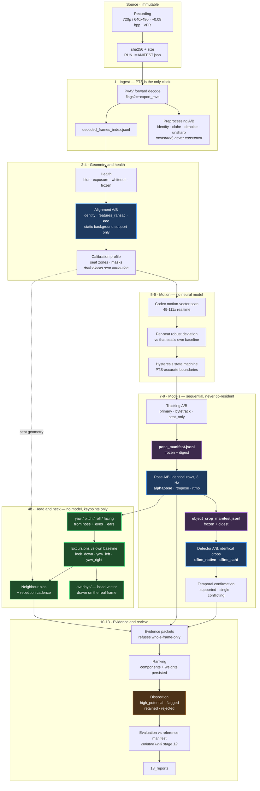

# Project Classroom — Architecture

**Team DataDynamo · Drishti AI Hackathon 2026**
**Reference run:** `artifacts/runs/1446/`

**Locked stack:** AlphaPose (FastPose_DUC res152) for pose · D-FINE native + D-FINE+SAHI for objects · classical CV for motion, alignment and preprocessing · **no VLM anywhere in the decision path**.

> **Historical-reference warning — 2026-08-22:** this document records the
> 1446 architecture and its then-current decisions. Later runs 1501/1504 added
> continuous person timelines and a hosted Roboflow paper prototype. They also
> demonstrated COCO phone false positives on seat placards and paper-prototype
> false positives on keyboards, mice and desk objects. Therefore statements
> below that say phones “work”, chits are wholly out of scope, or a ranking is
> wired must be read as historical claims about 1446, not release approval.
> The current implementation and release assessment are in
> [`FINAL_LOCK_IN_AUDIT.md`](FINAL_LOCK_IN_AUDIT.md) and
> [`CLASSIFICATION_AND_OPEN_QUESTIONS.md`](CLASSIFICATION_AND_OPEN_QUESTIONS.md).

---

## 1. What this system is

The problem statement's mitigation strategy fixes the product:

> The system should function as an **offline investigation support tool** that automatically prioritizes and summarizes recorded footage for human reviewers… while **maintaining human oversight in the final review process**.

So the deliverable is **triage**. The success metric is reviewer effort saved without losing real events — not accuracy on a cheating classifier. Nothing in this pipeline asserts misconduct; it produces ordered, timestamped, pixel-backed observations for a person to judge.

Two objectives drive the design, one from each problem statement:

| Source | Objective |
|---|---|
| PS #2 · O2–O3 | Detect motion regions and identify ROIs containing significant activity |
| PS #2 · O4 | Identify phones, paper/chits or other prohibited objects **as may be feasible** |
| PS #1 | Analyse **body posture, head orientation and hand movements** to identify repeated sideward glances, excessive head turning, body rotation toward neighbours |

The hedge on O4 is the only one in either document, and §6 explains exactly how far "feasible" reaches.

---

## 2. The corpus, measured

| Property | Measured |
|---|---|
| Resolution | 720p max; **video 04 is 640×480** |
| Compression | ~0.08 bits/pixel |
| Frame rate | variable on 4 of 6 files; **video 04 is 8 fps** |
| Codec motion vectors | present in all files, MPEG-4 included |
| Phone footprint at a near seat | ~30 × 20 px |
| **Median torso (shoulder) width** | 64 px (v01) · 84 px (v03) · **35 px (paper video)** |
| **Median interocular distance** | 9.3 px (v01) · 10.1 px (v03) · **4.7 px (paper video)** |

Three consequences run through everything below. **PTS is the only trusted clock** — frame indices are meaningless under VFR. **Objects are small enough that magnification adds interpolation, not detail**, so every stage carries an explicit resolution floor below which it abstains. And **faces are ~10 px across**, which decides §5 entirely.

---

## 3. Locked model selection

Every comparison ran on **byte-identical frozen manifests with recorded digests**, so a difference in output is attributable to the model and not to different inputs.

### 3.1 Pose — AlphaPose

| | AlphaPose | RTMPose | RTMO |
|---|---|---|---|
| Persons returned, v01 (379 rows) | **379 (100%)** | 337 (89%) | **199 (53%)** |
| Persons returned, v03 (217 rows) | **217 (100%)** | 148 (68%) | 112 (52%) |
| Joint visible fraction, v03 | 0.705 | **0.960** | 0.854 |
| R-wrist confidence, median (p10) | 0.84 (0.48) | 0.71 (0.36) | 0.99 (0.81) |
| R-wrist jitter, median / **p90** | 0.10 / **0.58** | 0.12 / 0.80 | **0.08** / 0.67 |
| rows/s, v01 | **2.46** | 1.30 | 1.68 |

**AlphaPose returns a person on every manifest row of both videos.** RTMO returns half — disqualifying on a problem whose first named challenge is crowded halls. RTMO's wrist confidence is *saturated*, not calibrated (median 0.99, IQR 0.01): it reports near-certainty on wrists it never resolved, which removes the pipeline's ability to decline. AlphaPose also wins the jitter **tail** (p90 0.58 vs 0.67/0.80), which is what "stable over a long run" means for a wrist-anchored crop chain.

All three agree on the angles — head pitch −0.44/−0.43/−0.47, torso lean 34.0°/30.2°/30.7°, right elbow 154°/147°/152°. Three independently trained models converging on identical frames is the strongest evidence the angles are real.

RTMPose is retained as the named challenger. RTMO is retained as the correct choice for a real-time variant, where one-stage speed matters and 53% coverage can be compensated by frame rate.

### 3.2 Objects — D-FINE, native and SAHI

Identical crops, video 03 (217) and video 01 (379):

| Configuration | Phone v03 | Phone v01 | Hard negatives v03 | Crops/s |
|---|---|---|---|---|
| **dfine_sahi** | **159** | **158** | 1165 | 0.24 |
| dfine_native | 108 | 92 | 735 | 1.58 |
| rf_detr_sahi | 19 | 34 | 94 | 0.79 |
| rf_detr_native | 10 | 11 | **53** | **5.06** |

D-FINE+SAHI recovers 8–15× more phone evidence at the same crops. Its cost is a heavy hard-negative load — 458 `keyboard` and 405 `monitor_or_bezel` calls on video 03, where RF-DETR sees 7 and 47. That is contained structurally, not by threshold tuning: **only target-class evidence can influence rank** (§7.2).

RF-DETR **XL/2XL do not exist for detection** — verified in `rfdetr/assets/model_weights.py`, where extra-large weights ship only for segmentation and keypoints. RF-DETR **Large** was launched and killed at 32 minutes with zero rows flushed; nano-vs-large remains open.

---

## 4. Locked preprocessing

Four named configurations on identical frames, `identity` present as a **named baseline** rather than as the absence of a configuration:

| Transform | v01 Δsharp | v01 Δblocking | v03 Δsharp | v03 Δblocking | cost |
|---|---|---|---|---|---|
| `identity_no_preprocessing` | 0.00 | 0.0000 | 0.00 | 0.0000 | 0.7 s |
| `clahe` | +203.18 | −0.0122 | +42.14 | **+0.0463** | 1.0 s |
| `denoise_nlmeans` | −30.66 | −0.0091 | −9.18 | **−0.2414** | **9.7 s** |
| `unsharp_mask` | +878.47 | −0.0090 | +223.88 | **+0.2315** | 1.0 s |

**Measurement path locked to `identity`.** The two videos disagree in sign: on video 01 (baseline blocking 1.0954) every transform *reduced* blocking; on video 03 (blocking **1.4632**, a visibly more compressed source) CLAHE and unsharp *raised* it while raising sharpness. At a 30×20 px object scale, amplifying compression structure is indistinguishable from amplifying the object. A transform that helps the clean source and hurts the dirty one does not get locked in — and no transform has been *shown to help*, because that needs a reference manifest and none exists.

**Presentation path locked to `clahe`, labelled.** A reviewer looking at a 60×30 px crop benefits from local contrast, and nothing in the review panel feeds a measurement.

**Camera motion locked to ECC, gated.** On video 03 (18.4% static background support): ECC compensated 6/15 spans at median residual 0.2318; `features_ransac` 0/15 at 0.2699; `identity` 0/15 at **6.5655**. Identity's residual proves there is real motion to correct. The 9 spans ECC cannot fit are labelled `camera_motion_uncertain`, keep raw evidence, and carry a 0.4× rank penalty. Fitting uses **static background support only** — fitting on pixels containing people measures the people.

---

## 5. Head and neck orientation — the new stage

### 5.1 What was broken

AlphaPose returns **nose, left_eye, right_eye, left_ear, right_ear**. The pipeline decoded all five, stored all five, and used one:

```python
observation.head_pitch = (nose_y - shoulder_y) / scale
```

A vertical offset, not an angle — and **no yaw at all**, so "turned toward a neighbour" was not measured anywhere.

### 5.2 Why not a face-landmark head-pose model

Published exam-proctoring stacks ([SamratSengupta](https://github.com/SamratSengupta/exam-proctoring-video-analytics), [AarambhDevHub](https://github.com/AarambhDevHub/exam-cheating-detection), [kyandap](https://github.com/kyandap/exam-cheating-detection), [EduView](https://github.com/Yudhyy/EduView)) are **webcam proctoring**: one frontal face filling the frame, MediaPipe/dlib/RetinaFace landmarks into [`solvePnP`](https://github.com/jerryhouuu/Face-Yaw-Roll-Pitch-from-Pose-Estimation-using-OpenCV). FaceMesh wants ~64 px of face; dlib-68 wants ~80 px. **We have 4.7–10.1 px interocular.**

The transferable idea is the [head-pose-estimation](https://github.com/topics/head-pose-estimation) approach of deriving orientation from **body keypoints** rather than face landmarks — which is what we have, at 0.84–0.93 median confidence on 73–96% of observations. Position survives at 10 px even though detail does not, and orientation is a question about position.

**Eye-gaze tracking is not implemented and cannot be.** At this scale an eye is 2–3 px; there is no iris. Any gaze claim here would be fabricated.

### 5.3 The measures

All are **normalised projective proxies** — monotonic in the true angle, comparable within one subject over time, not comparable to a protractor. Recovering real Euler angles needs camera intrinsics and a face model; this corpus supports neither.

| Measure | Derivation | Why this form |
|---|---|---|
| **yaw** | nose offset from ear midpoint ÷ half ear separation | Ears sit near the rotation axis, nose forward of it ⇒ `sin(yaw)` for a spherical head |
| **yaw, one ear only** | saturated ±1.0, direction from surviving ear | The other ear is occluded *by the turn*; that occlusion is the measurement |
| **pitch** | eye midpoint − ear midpoint, ÷ head scale | Eyes sit forward of the ear axis; independent of the shoulder line a sloucher moves |
| **roll** | eye-line tilt − shoulder-line tilt | Measured against the body, so an off-level camera does not read as every head tilted |
| **yaw_relative_to_torso** | yaw × shoulder squareness | Separates *turning the neck* from *rotating the whole body* — different behaviours |
| **facing** | `frontal` / `turned_left` / `turned_right` / `downward` / `not_resolvable_at_source_scale` | The pipeline's existing four-state observability idiom |

### 5.4 Temporal metrics — where the behaviour actually is

| Metric | Definition |
|---|---|
| **look_down excursion** | Contiguous span with pitch ≥ seat median + 3·MAD, ≥1.5 s |
| **yaw_left / yaw_right excursion** | Same, signed, so direction is preserved |
| **longest / total look-down** | Reported as **durations**, not frame counts |
| **neighbour bias** | Whether turns point at an *occupied adjacent seat* (calibration geometry) rather than an aisle or wall |
| **repeated_same_direction** | Excursions the same way within 60 s — the discriminator PS #1 asks for between a stretch and sustained attention elsewhere |

**Every threshold is against that subject's own median and MAD**, never a universal angle. The camera looks down at the front row and across at the back; a fixed "yaw beyond 30°" rule would flag one row permanently and never flag another.

### 5.5 Two defects this stage exposed

**The merge gap was shorter than the sample period.** `merge_gap_ms = 800` with 1 Hz sampling split every run into singletons, so no event could ever reach the 1.5 s minimum. Measured before the fix: **1 event across 379 observations of 29 tracks.** The gap is now derived per track from the observed sampling interval.

**Sampling at 1 Hz cannot support head analysis.** Run `1446` samples at **3 Hz**, which also gives the IoU tracker smaller inter-frame motion to match against, so tracks survive longer.

---

## 6. Objects: phones work, chits do not

**Phones are a detection problem and it works.** COCO has a `cell phone` class; D-FINE+SAHI finds 159 instances on video 03 and 158 on video 01 across identical crops, each with a source-frame box, PTS, crop provenance and confidence. Detections are grouped in time into four statuses — supported, single-frame, conflicting, insufficient — and **nothing is deleted**: a singleton is a status, not a reason to discard.

**Chits are not a detection problem.** No COCO head has a chit class. Every "chit" this pipeline ever reported arrived as COCO `book` remapped by `COCO_TO_TAXONOMY`; rendering those frames showed answer sheets, question papers and printed packaging. A classical paper-region scanner was built and **withdrawn**: it fired on shirt collars, chair-back highlights and desk edges, and on a chit-negative video produced candidates that were all false. It is not in this architecture.

Chit detection is therefore **explicitly out of scope** under PS #2's own "as may be feasible" hedge, until a labelled chit dataset exists to fine-tune against.

---

## 7. Review dispositions

### 7.1 Bands cannot be score thresholds

The top event on video 01 scores **85.63** and on video 03 **9.92**, because the dominant component is motion deviation in that seat's own baseline units. A fixed cut would put every video-01 event above every video-03 event regardless of content. So the motion-only route into the queue is defined on **rank within the run**; the corroborated route is defined on **evidence** and ignores rank.

### 7.2 The four bands

| Disposition | Rule |
|---|---|
| **`high_potential_corroborated`** | target-class object evidence confirmed across frames **AND** sustained pose context **AND** resolved seat **AND** no active penalty |
| **`flagged_for_review`** | partial corroboration (object *or* pose), **or** top 25% of gate-passing events on motion alone |
| **`retained_low_priority`** | passed the gate, below the top 25%, nothing corroborates it |
| **`rejected_not_offered`** | a gate refused it — **withheld from the queue, never cleared**; keeps its score, stays searchable |

`rejected` deliberately does not mean "no misconduct" — a band meaning "cleared" would be a finding this pipeline is not entitled to make.

**Only target-class evidence corroborates.** Temporal confirmation runs on everything the detector emits; on video 03 that is 334 confirmed `unknown_object`, 103 `monitor_or_bezel` and 76 `keyboard` against 36 `phone`. Counting furniture put **34 of 46 events** into the top band; filtering to `TARGET_CLASSES` dropped it to **1**.

**Measured triage load:** video 01, 46 events → **13 in the queue (−72%)**; video 03, 23 events → 19, of which **1 high-potential** (a confirmed phone plus sustained pose at seat S-61, on a recording titled *"CCTV Mobile Usage"*).

### 7.3 A defect this fixed

`ranking.rank()` was called **without** `pose_by_event` or `objects_by_event`. Both `object_supported` (weight 2.0, the heaviest component) and `pose_sustained` (weight 1.2) evaluated to zero on **all 69 ranked events across two videos** — the entire detector and pose effort had no influence on the ordering a reviewer sees. Now wired.

---

## 8. The pipeline



### 8.1 The two invariants

**Frozen manifests.** Every configuration is handed byte-identical rows and the digest is written into every result, so PRD §4's "identical rows" is checkable rather than asserted. Two defects were caught by this that would otherwise have shipped as findings: a shared forward-only frame reader that scored the second pose model 1/74 purely for running second, and a `row_id` keyed on event rather than frame that produced 74 rows with 42 unique ids.

**Reference-manifest isolation.** Readable only at stage 12; `assert_isolated()` scans for leakage and has fired in anger — a field named `reference_result` tripped it and was renamed `evaluation_status`.

---

## 9. Run 1446 artifact layout

```
artifacts/runs/1446/
├── RUN_1446_SUMMARY.json          per-video state and per-stage timings
├── 01_phone.log  04_talking.log  12_paper.log
└── <video>/
    ├── RUN_MANIFEST.json          source sha256, models, configs
    ├── RUN_STATUS.json            per-stage state, resumable
    ├── 01_ingest/                 decoded PTS index, anomalies
    │   └── preprocessing/         raw / transformed / difference + comparison.json
    ├── 02_health/                 blur, exposure, whiteout observations + frames
    ├── 03_alignment/              raw, reference, static_mask, compensated,
    │                              difference per timestamp + comparison.json
    ├── 05_motion_roi/             candidate manifest, per-seat statistics
    ├── 06_segmentation/           events.jsonl, PTS-accurate boundaries
    ├── 07_tracking/               three trackers, seat-inconsistent transitions
    ├── 08_pose/
    │   ├── pose_manifest.jsonl    frozen rows + digest
    │   ├── alphapose_crowd_baseline/observations.jsonl   17 keypoints each
    │   ├── rtmpose_baseline/  rtmo_baseline/
    │   ├── comparison.json    pose_metrics.json
    │   └── head/                  ← the new stage
    │       ├── per_observation.jsonl   yaw, pitch, roll, facing, keypoints used
    │       ├── excursions.jsonl        sustained turns and dwells, with duration
    │       ├── summary.json            per-seat/track metrics + neighbour bias
    │       └── overlays/               frames with the head vector drawn
    ├── 09_object/
    │   ├── object_crop_manifest.jsonl  frozen crops + digest
    │   ├── dfine_native/  dfine_sahi/  merged_detections.jsonl
    │   ├── comparison.json
    │   └── dfine_sahi/rendered_<class>/  full frames + native crops
    ├── 10_evidence/               packets, temporal_confirmation, ranked_events
    ├── 12_evaluation/             isolation check, evaluation status
    └── 13_reports/                final report
```

---

## 10. What is measured, and what is not

**Measured and defensible:** motion ROIs and event segmentation with PTS-accurate boundaries; per-seat robust baselines; camera-motion compensation with an explicit gate; person tracking with seat reconciliation; 17-keypoint pose from three models on identical rows; **head yaw, pitch, roll, facing state, sustained excursions, neighbour bias and repetition**; phone and general object detection with temporal confirmation; a four-band review disposition with every component persisted.

**Not measured, and stated as such:** eye gaze and iris direction (impossible at 4.7–10.1 px interocular); chit detection (no class, no dataset — §6); face identity (never computed, by design); any assertion that misconduct occurred.

---

## 11. Open items

| Item | Blocking? | Owner decision |
|---|---|---|
| **Reference manifest** — no human labels, so no recall/precision anywhere | Yes | Yes |
| **Calibration approval** — 5 of 6 profiles are DRAFT, so seat attribution is blocked and head metrics key on track id instead | Yes for seat-attributed claims | Yes |
| Track fragmentation — 29 tracks over 379 observations at 1 Hz | Degrades head metrics | No |
| Over-segmentation — 96.5% of one recording flagged | Degrades triage | No |
| Motion heatmaps and ROI overlays not rendered (PS #2 O6) | Partial O6 | No |
| Per-seat baseline pitch not supplied, so `pose_sustained` fires 19/19 | Not discriminative | No |
| `pipeline/gemma_review.py` and the `11_gemma` stage remain, inert | No | Yes — say the word |
| AlphaPose licence: SJTU **academic / non-commercial research only** | Blocks commercial deployment | Yes |

---

## Appendix — commands

```bash
python tools/run_1446.py
```

Per video, sequentially, one model resident at a time:

```bash
python tools/preflight_rtx3090.py --experiment configs/experiments/product_zero.yaml --sources VIDEO --run-id 1446/LABEL
python tools/validate_video.py --run artifacts/runs/1446/LABEL VIDEO
python tools/run_preprocessing_ab.py --run artifacts/runs/1446/LABEL VIDEO
python tools/run_alignment.py --run artifacts/runs/1446/LABEL --calibration CALIB VIDEO
python tools/run_motion_scan.py --run artifacts/runs/1446/LABEL --calibration CALIB VIDEO
python tools/run_pose_ab.py --run artifacts/runs/1446/LABEL --calibration CALIB --person-model models/dfine/onnx/model.onnx --pose --sample-hz 3.0 VIDEO
python tools/run_head_analysis.py VIDEO --run artifacts/runs/1446/LABEL --calibration CALIB --overlays 24
python tools/run_detector_ab.py --run artifacts/runs/1446/LABEL --calibration CALIB --dfine models/dfine/onnx/model.onnx --no-rfdetr VIDEO
python tools/render_evidence_packet.py VIDEO --run artifacts/runs/1446/LABEL --calibration CALIB
python tools/evaluate_run.py --run artifacts/runs/1446/LABEL
```

Auditing every detection ever produced:

```bash
python tools/export_detections.py
```
